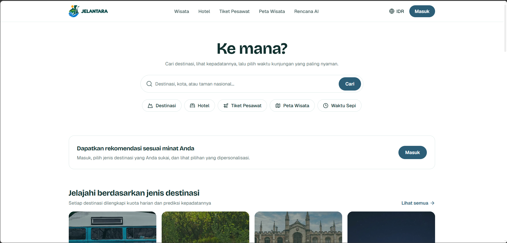
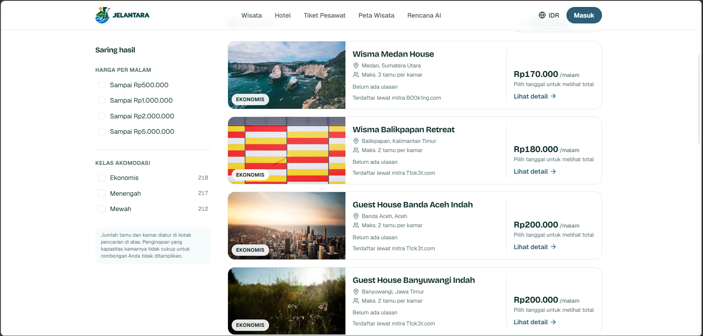
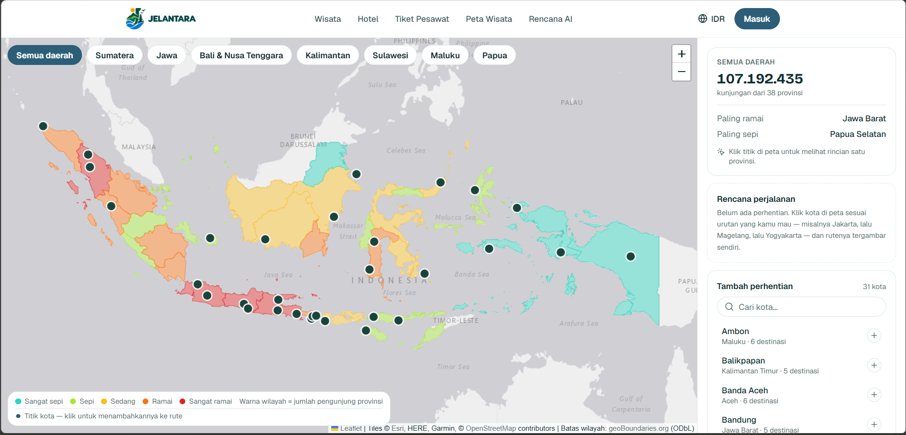
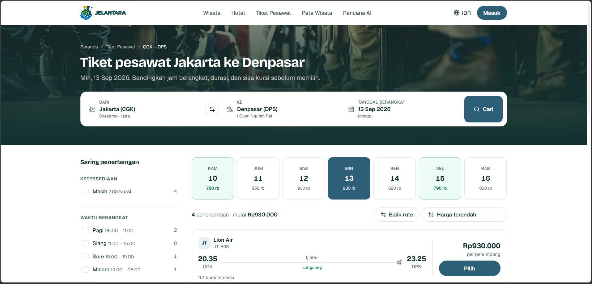
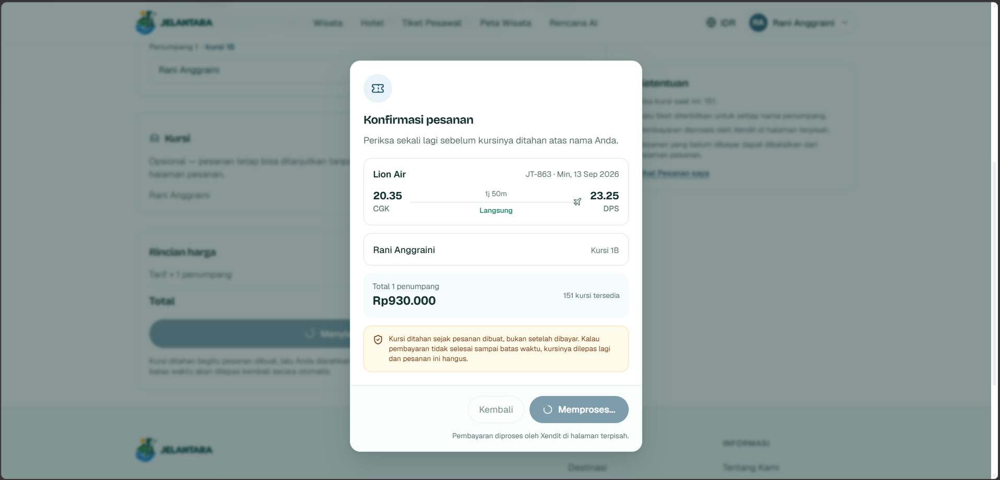
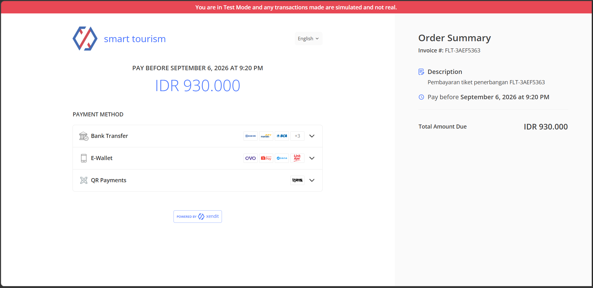
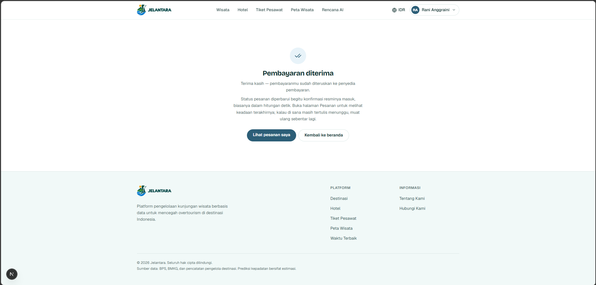
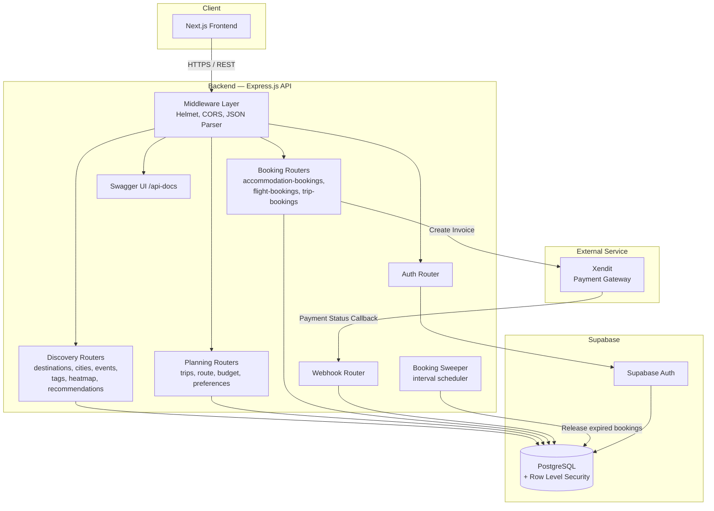
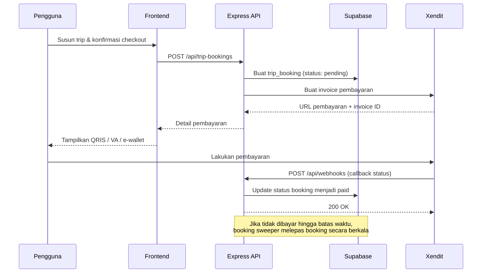

<div align="center">

# 🗺️ Jelantara 

### Explore the Wonders of Indonesia — Karena Indonesia Bukan Cuma Bali

[](https://jelantara.iitech.id)
[](https://github.com/eleazerv/Smart-Tourism)
[](LICENSE)

**Submission for ITECHNO CUP 2026 — Web Development**

</div>

---

## 📋 Daftar Isi

- [Tentang Proyek](#-tentang-proyek)
- [Fitur Unggulan](#-fitur-unggulan)
- [Demo & Screenshot](#-demo--screenshot)
- [Teknologi](#️-teknologi)
- [Arsitektur Sistem](#️-arsitektur-sistem)
- [Instalasi & Setup](#️-instalasi--setup)
- [Penggunaan](#-penggunaan)
- [API Documentation](#-api-documentation)
- [Testing](#-testing)
- [Tim Developer](#-tim-developer)
- [Lisensi](#-lisensi)

---

## 👥 Tim Developer

| Nama | Peran | GitHub |
|------|-------|--------|
| Eleazer Valentino | Backend Developer | [@eleazerv](https://github.com/eleazerv) |
| Inner Journey Tazkie Ciputra Tangguh  | Frontend Developer | [@TazkieCT](https://github.com/TazkieCT) |

---

## 🎯 Tentang Proyek

### Latar Belakang

Siapa pun baik turis mancanegara maupun orang Indonesia sendiri, destinasi wisata Indonesia apa aja yang mereka tau. Jawabannya hampir selalu berhenti di satu nama: **Bali**.

Padahal Indonesia punya lebih dari 17.000 pulau dan 38 provinsi. Di **Kalimantan** ada hutan hujan tropis tertua di dunia, sungai-sungai besar, dan habitat orangutan. Di **Papua** ada Raja Ampat yang diakui sebagai salah satu titik biodiversitas laut terkaya di planet ini, plus Lembah Baliem dengan budaya yang masih terjaga. Di **Sumatera** ada Danau Toba (danau vulkanik terbesar di dunia), Bukit Lawang, dan situs-situs budaya Minangkabau.

Masalahnya bukan destinasinya tidak ada. Masalahnya adalah:

1. **Ketimpangan eksposur**,  Bali mendominasi hasil pencarian, konten media sosial, dan paket travel agent, sementara destinasi lain nyaris tak terlihat.
2. **Friksi perencanaan**, Merencanakan trip ke luar Bali jauh lebih ribet. Informasi akomodasi, penerbangan, dan estimasi biaya tersebar di banyak platform yang tidak saling terhubung.
3. **Ketidakpastian budget**, Calon wisatawan sering mundur karena tidak punya gambaran biaya total sebelum benar-benar mulai memesan.

Dampaknya bukan cuma soal "kurang terkenal". Daerah dengan potensi wisata besar kehilangan peluang ekonomi, sementara Bali menanggung beban *over-tourism*.

### Solusi yang Ditawarkan

**Jelantara** adalah platform smart tourism yang memangkas friksi perencanaan perjalanan ke destinasi Indonesia di luar rute mainstream.

Alih-alih memaksa pengguna membuka lima tab berbeda untuk mencari destinasi, mengecek harga hotel, membandingkan tiket pesawat, dan menghitung total biaya, Jelantara menyatukan semuanya dalam satu alur:

**Temukan → Rencanakan → Estimasi Biaya → Pesan**

Sistem rekomendasi Jelantara secara sengaja mengangkat destinasi di Kalimantan, Papua, dan Sumatera berdasarkan preferensi pengguna (jenis wisata, budget, durasi), bukan berdasarkan popularitas semata. Perencanaan trip mendukung format multi-kota, sehingga pengguna bisa merangkai perjalanan lintas daerah dalam satu itinerary , misalnya Medan → Danau Toba → Bukittinggi, lengkap dengan penerbangan antar-kota dan akomodasi per titik singgah, lalu membayarnya dalam satu invoice.

### Tujuan Proyek

- 🎯 **Tujuan Utama**: Meratakan eksposur destinasi wisata Indonesia dengan menurunkan hambatan riset dan perencanaan perjalanan ke seluruh daerah Indonesia.
- 📊 **Target Pengguna**: Wisatawan domestik dan mancanegara yang ingin eksplorasi destinasi Indonesia di luar rute wisata konvensional, terutama traveler mandiri yang merencanakan sendiri perjalanannya.
- 💡 **Value Proposition**: Satu platform untuk menemukan destinasi, menyusun itinerary multi-kota, mengestimasi total biaya, dan memesan akomodasi serta penerbangan — dengan kurasi yang berpihak pada daerah yang selama ini kurang terekspos.

---

## ✨ Fitur Unggulan

### Fitur Utama

| Fitur | Deskripsi | Keunggulan |
|-------|-----------|------------|
| **Rekomendasi Destinasi Personal** | Sistem rekomendasi yang mencocokkan destinasi dengan preferensi pengguna berdasarkan tag minat, lokasi, dan kedekatan geografis | Ranking tidak semata-mata berbasis popularitas, sehingga destinasi di Kalimantan, Papua, dan Sumatera mendapat eksposur yang setara |
| **Trip Planner Multi-Kota** | Susun satu perjalanan yang terdiri dari beberapa kota singgah, masing-masing dengan tanggal, akomodasi, dan penerbangan kedatangan/keberangkatan sendiri | Memungkinkan perjalanan lintas provinsi dirangkai dalam satu itinerary, bukan dipesan terpisah-pisah |
Konsultasi Trip dengan AI | Pengguna bisa berdiskusi dengan AI untuk menyusun rencana perjalanan secara matang — mulai dari destinasi, akomodasi, hingga penerbangan — lengkap dengan estimasi biayanya. Begitu rencananya sudah sesuai, pengguna bisa langsung checkout dari situ tanpa menyusun ulang di tempat lain | Perjalanan dirancang dengan pertimbangan matang sebelum dipesan, dan begitu yakin, prosesnya lanjut tanpa jeda
| **Checkout Satu Invoice** | Seluruh pemesanan dalam satu trip (akomodasi di berbagai kota + penerbangan antar-kota) digabung menjadi satu tagihan pembayaran | Menghilangkan kerepotan membayar ke banyak vendor secara terpisah |
| **Pembayaran Lokal via Xendit** | Mendukung QRIS, Virtual Account, dan e-wallet dengan konfirmasi status melalui webhook | Metode pembayaran yang familiar bagi pengguna Indonesia, dengan status pembayaran yang akurat tanpa bergantung pada polling frontend |

### Fitur Tambahan

- **Saved Destinations** , Simpan destinasi yang menarik untuk dirujuk kembali saat menyusun trip.
- **Filter Berbasis Tag**, Telusuri destinasi berdasarkan kategori minat seperti alam, budaya, bahari, atau petualangan.
- **Heatmap Destinasi**, Visualisasi persebaran destinasi secara geografis untuk membantu pengguna melihat opsi di luar pulau Jawa dan Bali.
- **Direktori Kota**, Jelajahi destinasi, akomodasi, dan penerbangan yang terhubung ke setiap kota.
- **Kalender Event**, Informasi acara dan festival yang berlangsung di sekitar destinasi, berguna untuk menentukan waktu berkunjung.
- **Chat Assistant**, Antarmuka percakapan untuk membantu pengguna mengeksplorasi destinasi dan menyusun rencana perjalanan.
- **Pencarian Rute**, Pencarian jalur perjalanan antar titik untuk membantu perencanaan pergerakan dalam trip.
- **Auto-Release Booking Kedaluwarsa**, Booking yang tidak dibayar hingga batas waktu otomatis dilepas oleh scheduler berkala, sehingga ketersediaan tidak tertahan selamanya.

---

## 📸 Demo & Screenshot

### Live Demo

🔗 **[Kunjungi Website](https://jelantara.iitech.id)**


### Screenshot Aplikasi

<div align="center">
  
  <p><em>Homepage — Eksplorasi destinasi unggulan di Indonesia</em></p>
  
  <p><em>DestinationPage — Eksplorasi semua destinasi yang terkurasi </em></p>
  
  <p><em>HeatMap — Amati persebaran turis di Indonesia </em></p>
  
  <p><em>FlightPage — Cari tiket pesawat yang sesuai denganmu</em></p>
  
  <p><em>Checkout - bayar tiket pesawatmu </em></p>
    
  <p><em>CheckoutSuccess - tiket pesawatmu berhasil</em></p>
    
  <p><em>Payment Success - pembayaran selesai , nikmati liburanmu  </em></p>
</div>


## 🛠️ Teknologi

### Tech Stack

#### Frontend

```
Framework    : Next.js (React)
UI Library   : Tailwind CSS
State Mgmt   : React Context API
HTTP Client  : Fetch API
```

#### Backend

```
Runtime      : Node.js v18+
Framework    : Express.js (ES Modules)
Database     : PostgreSQL (Supabase)
Auth         : Supabase Auth + Row Level Security
Payment      : Xendit (QRIS, Virtual Account, E-wallet)
API Docs     : Swagger UI (swagger-ui-express + swagger-jsdoc)
Security     : Helmet, CORS
Config       : dotenv
```

#### DevOps & Tools

```
Database Host : Supabase
Deployment    : Vercel (frontend) + VM (backend)
CI/CD         : Github action
API Testing   : Swagger UI
Version Ctrl  : Git & GitHub
```

### Alasan Pemilihan Teknologi

| Teknologi | Alasan Pemilihan |
|-----------|------------------|
| **Express.js** | Ringan dan tidak memaksakan struktur tertentu, cocok untuk API dengan banyak domain modul terpisah (destinations, trips, bookings, payments). Ekosistem middleware-nya matang, sehingga kebutuhan seperti security header dan CORS bisa dipasang tanpa konfigurasi berat. |
| **Supabase (PostgreSQL)** | Menyediakan PostgreSQL terkelola sekaligus sistem autentikasi, sehingga tim tidak perlu membangun auth dari nol di tengah tenggat kompetisi. Row Level Security memungkinkan aturan kepemilikan data (misalnya "pengguna hanya bisa melihat trip miliknya sendiri") ditegakkan di lapisan database, bukan hanya di kode aplikasi. |
| **PostgreSQL** | Data Jelantara sangat relasional — trip terhubung ke stop, stop terhubung ke kota, akomodasi, dan penerbangan. PostgreSQL juga mendukung perhitungan jarak geografis yang dipakai untuk mengurutkan destinasi berdasarkan kedekatan lokasi. |
| **Xendit** | Payment gateway yang mendukung metode pembayaran khas Indonesia (QRIS, Virtual Account bank lokal, e-wallet). Model webhook-nya memastikan status pembayaran akurat meskipun pengguna menutup browser setelah membayar. |
| **Swagger UI** | Dokumentasi API yang bisa dicoba langsung dari browser, memudahkan sinkronisasi antara developer backend dan frontend selama pengembangan paralel. |
| **Helmet** | Memasang HTTP security header (CSP, X-Frame-Options, X-Content-Type-Options) secara default untuk mengurangi permukaan serangan umum seperti clickjacking dan MIME sniffing. |

### Dependencies Utama

```json
{
  "dependencies": {
    "express": "^4.19.2",
    "@supabase/supabase-js": "^2.45.0",
    "cors": "^2.8.5",
    "helmet": "^7.1.0",
    "dotenv": "^16.4.5",
    "swagger-ui-express": "^5.0.1",
    "swagger-jsdoc": "^6.2.8",
    "xendit-node": "^6.0.0"
  }
}
```

---

## 🏗️ Arsitektur Sistem

### System Architecture



### Alur Pemesanan & Pembayaran



### Pola Dual-Client Supabase

Backend menggunakan dua klien Supabase dengan tingkat hak akses berbeda:

| Klien | Digunakan Untuk | Alasan |
|-------|-----------------|--------|
| `req.db` (scoped ke token pengguna) | Operasi pada data milik pengguna: trip, booking, preferensi, saved destinations | Row Level Security ditegakkan di lapisan database, sehingga pengguna tidak bisa mengakses data milik pengguna lain meskipun ada celah di kode aplikasi |
| `supabase` (service role) | Pembacaan data publik: destinasi, kota, event, akomodasi, penerbangan | Data publik tidak perlu melewati pengecekan RLS per pengguna, sehingga query lebih sederhana dan konsisten untuk semua pengunjung |

### Database Schema

Skema database Jelantara terdiri dari 37 tabel yang mencakup master data wisata (provinsi, kota, destinasi, akomodasi, penerbangan), data transaksional (trips, bookings), serta data interaksi pengguna (reviews, saved destinations, chat).

**Ringkasan struktur:**

- **Master data lokasi** — `provinces` → `cities` → `airports`, dengan pencarian fuzzy via `pg_trgm` (`idx_cities_name_trgm`, dst).
- **Katalog wisata** — `destinations`, `accommodations`, `flight_options`, `events`, `climate_patterns`.
- **Tag ternormalisasi** — Relasi many-to-many antara destinasi/climate pattern dan tag lewat tabel junction (`destination_tags`, `climate_pattern_tags`, `user_preference_tags`), sehingga satu entitas bisa punya banyak kategori minat tanpa duplikasi data.
- **Hirarki trip** — Model perjalanan memakai struktur `trips` → `trip_stops` → `trip_items` / `trip_flights`. Setiap stop mewakili satu kota dengan akomodasi dan tanggalnya sendiri, sehingga perjalanan lintas provinsi bisa dimodelkan secara akurat.
- **Booking & pembayaran** — Booking dipecah per domain (`flight_bookings` + `flight_booking_items` + `flight_tickets` + `flight_seats`, `accommodation_bookings` + `accommodation_booking_rooms`), lalu bisa disatukan lewat `trip_bookings` untuk checkout satu invoice. Semua status pembayaran mengikuti alur `pending → paid/failed` yang diatur lewat function `settle_booking`.
- **Logic di database** — Sebagian besar aturan bisnis booking (alokasi kamar/kursi, pembuatan kode booking, pelunasan, pembatalan) ditulis sebagai PL/pgSQL function `SECURITY DEFINER` (`create_flight_booking`, `create_accommodation_booking`, `create_trip_booking`, `settle_booking`, `cancel_booking`, `claim_flight_seat`) agar validasi ketersediaan tetap atomik meski diakses concurrent.
- **Row Level Security** — RLS aktif di seluruh 37 tabel; tabel milik pengguna (trips, bookings, reviews, chat, dst) dibatasi dengan policy `auth.uid() = user_id` atau join ke tabel induk, sementara tabel master data bersifat `read` publik.
- **Rating otomatis** — Trigger `trg_update_rating` dan `trg_update_accommodation_rating` menghitung ulang `avg_rating` setiap kali ada perubahan pada `reviews`/`accommodation_reviews`.

<details>
<summary><strong>📄 Lihat full SQL schema export (tables, constraints, indexes, RLS policies, functions, triggers)
</strong></summary>

```sql
-- Export schema - dikelompokkan per kategori - Sun Sep  6 19:56:11 SEAST 2026

-- ============================================================
-- TABEL
-- ============================================================

create table accommodation_booking_rooms (
  id uuid not null default gen_random_uuid(),
  booking_id uuid not null,
  accommodation_id uuid not null,
  room_name text not null,
  check_in date not null,
  check_out date not null,
  guests integer not null,
  price_per_night numeric not null,
  nights integer not null,
  subtotal numeric not null
);
create table accommodation_bookings (
  id uuid not null default gen_random_uuid(),
  user_id uuid not null,
  trip_id uuid,
  booking_code text not null,
  total_price numeric not null,
  payment_status text default 'pending'::text,
  payment_method text,
  created_at timestamp without time zone default now(),
  paid_at timestamp without time zone,
  xendit_invoice_id text,
  invoice_url text,
  invoice_expires_at timestamp without time zone,
  trip_booking_id uuid
);
create table accommodation_reviews (
  id uuid not null default gen_random_uuid(),
  accommodation_id uuid not null,
  user_id uuid not null,
  rating integer not null,
  comment text,
  photo_url text,
  created_at timestamp without time zone default now()
);
create table accommodations (
  id uuid not null default gen_random_uuid(),
  name text not null,
  tier text not null,
  price_per_night numeric not null,
  partner_name text,
  external_url text,
  latitude numeric,
  longitude numeric,
  cover_image_url text,
  max_guests integer not null default 2,
  city_id integer,
  avg_rating numeric default 0,
  review_count integer default 0,
  room_count integer not null default 5
);
create table airports (
  id integer not null default nextval('airports_id_seq'::regclass),
  city_id integer not null,
  code text not null,
  name text,
  latitude numeric not null,
  longitude numeric not null,
  utc_offset smallint not null default 7
);
create table album_items (
  album_id uuid not null,
  destination_id uuid not null,
  added_at timestamp with time zone not null default now()
);
create table albums (
  id uuid not null default gen_random_uuid(),
  user_id uuid not null,
  name text not null,
  created_at timestamp with time zone not null default now(),
  updated_at timestamp with time zone not null default now(),
  share_token uuid
);
create table budget_estimates (
  id uuid not null default gen_random_uuid(),
  user_id uuid,
  destination_id uuid,
  origin_city_id integer,
  tier text,
  duration_days integer,
  travelers integer,
  total_estimate numeric,
  created_at timestamp without time zone default now()
);
create table chat_messages (
  id uuid not null default gen_random_uuid(),
  room_id uuid not null,
  role text not null,
  content text,
  tool_name text,
  tool_args jsonb,
  created_at timestamp without time zone default now(),
  interactive jsonb
);
create table chat_rooms (
  id uuid not null default gen_random_uuid(),
  user_id uuid not null,
  trip_id uuid,
  title text not null default 'Percakapan baru'::text,
  created_at timestamp without time zone default now(),
  updated_at timestamp without time zone default now()
);
create table cities (
  id integer not null default nextval('cities_id_seq'::regclass),
  name text not null,
  province_id integer,
  airport_code text[],
  is_major_hub boolean default false
);
create table climate_pattern_tags (
  climate_pattern_id uuid not null,
  tag_id uuid not null
);
create table climate_patterns (
  id uuid not null default gen_random_uuid(),
  province_id integer not null,
  season text not null,
  months integer[] not null,
  recommended_activities text[]
);
create table destination_tags (
  destination_id uuid not null,
  tag_id uuid not null
);
create table destination_views (
  id uuid not null default gen_random_uuid(),
  destination_id uuid not null,
  user_id uuid,
  viewed_at timestamp without time zone default now()
);
create table destinations (
  id uuid not null default gen_random_uuid(),
  name text not null,
  province_id integer not null,
  city_id integer not null,
  description text,
  category text,
  latitude numeric not null,
  longitude numeric not null,
  cover_image_url text,
  avg_rating numeric default 0,
  view_count integer default 0,
  created_at timestamp without time zone default now()
);
create table events (
  id uuid not null default gen_random_uuid(),
  city_id integer not null,
  held_by text not null,
  destination_id uuid,
  latitude numeric,
  longitude numeric,
  name text not null,
  month integer not null,
  start_date date,
  end_date date,
  description text not null,
  is_annual boolean default true
);
create table flight_booking_items (
  id uuid not null default gen_random_uuid(),
  booking_id uuid not null,
  flight_option_id uuid not null,
  flight_type text not null,
  price numeric not null,
  quantity integer not null default 1
);
create table flight_bookings (
  id uuid not null default gen_random_uuid(),
  user_id uuid not null,
  trip_id uuid,
  booking_code text not null,
  total_price numeric not null,
  payment_status text default 'pending'::text,
  payment_method text,
  created_at timestamp without time zone default now(),
  paid_at timestamp without time zone,
  xendit_invoice_id text,
  invoice_url text,
  invoice_expires_at timestamp without time zone,
  trip_booking_id uuid
);
create table flight_options (
  id uuid not null default gen_random_uuid(),
  origin_city_id integer not null,
  destination_city_id integer not null,
  airline text,
  flight_number text,
  departure_time timestamp without time zone,
  arrival_time timestamp without time zone,
  price numeric not null,
  available_seats integer,
  currency text default 'IDR'::text,
  origin_airport_code text,
  destination_airport_code text
);
create table flight_seats (
  id uuid not null default gen_random_uuid(),
  flight_id uuid not null,
  ticket_id uuid not null,
  seat_number text not null,
  created_at timestamp without time zone default now()
);
create table flight_tickets (
  id uuid not null default gen_random_uuid(),
  booking_id uuid not null,
  ticket_code text not null,
  full_name text not null,
  created_at timestamp without time zone default now(),
  booking_item_id uuid not null,
  flight_type text not null
);

create table provinces (
  id integer not null default nextval('provinces_id_seq'::regclass),
  code text not null,
  name text not null,
  region text
);
create table review_likes (
  id uuid not null default gen_random_uuid(),
  review_id uuid not null,
  user_id uuid not null,
  created_at timestamp without time zone default now()
);
create table reviews (
  id uuid not null default gen_random_uuid(),
  destination_id uuid not null,
  user_id uuid not null,
  rating integer not null,
  comment text,
  photo_url text,
  created_at timestamp without time zone default now()
);
create table saved_destinations (
  id uuid not null default gen_random_uuid(),
  user_id uuid not null,
  destination_id uuid not null,
  created_at timestamp without time zone default now()
);
create table tags (
  id uuid not null default gen_random_uuid(),
  name text not null,
  slug text not null,
  description text,
  created_at timestamp without time zone default now()
);
create table trip_bookings (
  id uuid not null default gen_random_uuid(),
  trip_id uuid not null,
  user_id uuid not null,
  booking_code text not null,
  total_price numeric not null default 0,
  payment_status text default 'pending'::text,
  payment_method text,
  created_at timestamp without time zone default now(),
  paid_at timestamp without time zone,
  xendit_invoice_id text,
  invoice_url text,
  invoice_expires_at timestamp without time zone
);
create table trip_flights (
  id uuid not null default gen_random_uuid(),
  trip_id uuid not null,
  flight_option_id uuid not null,
  created_at timestamp without time zone default now(),
  booked_at timestamp without time zone,
  trip_stop_id uuid not null,
  flight_role text not null,
  confirmed boolean not null default false
);
create table trip_items (
  id uuid not null default gen_random_uuid(),
  destination_id uuid not null,
  sequence_order integer not null default 0,
  status text not null default 'suggested'::text,
  guests integer default 1,
  notes text,
  created_at timestamp without time zone default now(),
  added_by text not null default 'ai'::text,
  trip_stop_id uuid not null
);
create table trip_stops (
  id uuid not null default gen_random_uuid(),
  trip_id uuid not null,
  city_id integer not null,
  sequence_order integer not null default 0,
  check_in date,
  check_out date,
  accommodation_id uuid,
  created_at timestamp without time zone default now(),
  accommodation_status text not null default 'none'::text,
  accommodation_booking_id uuid
);
create table trips (
  id uuid not null default gen_random_uuid(),
  user_id uuid not null,
  destination_id uuid,
  origin_city_id integer,
  name text,
  start_date date,
  end_date date,
  travelers integer default 1,
  status text default 'planning'::text,
  created_at timestamp without time zone default now()
);
create table user_preference_tags (
  user_id uuid not null,
  tag_id uuid not null
);
create table users (
  id uuid not null,
  email text not null,
  full_name text not null,
  role text default 'tourist'::text,
  created_at timestamp without time zone default now(),
  avatar_url text
);
create table visitor_stats (
  id uuid not null default gen_random_uuid(),
  province_id integer,
  visitor_count integer not null,
  period text not null,
  source text default 'BPS'::text,
  fetched_at timestamp without time zone default now()
);

-- ============================================================
-- VIEW
-- ============================================================

create or replace view flight_options_enriched as
 SELECT fo.id,
    fo.origin_city_id,
    fo.destination_city_id,
    fo.airline,
    fo.flight_number,
    fo.departure_time,
    fo.arrival_time,
    fo.price,
    fo.available_seats,
    fo.currency,
    fo.origin_airport_code,
    fo.destination_airport_code,
    oa.utc_offset AS origin_utc_offset,
    da.utc_offset AS destination_utc_offset,
        CASE oa.utc_offset
            WHEN 7 THEN 'WIB'::text
            WHEN 8 THEN 'WITA'::text
            WHEN 9 THEN 'WIT'::text
            ELSE NULL::text
        END AS origin_timezone,
        CASE da.utc_offset
            WHEN 7 THEN 'WIB'::text
            WHEN 8 THEN 'WITA'::text
            WHEN 9 THEN 'WIT'::text
            ELSE NULL::text
        END AS destination_timezone,
    EXTRACT(epoch FROM fo.arrival_time - fo.departure_time) / 60::numeric - ((da.utc_offset - oa.utc_offset) * 60)::numeric AS duration_minutes
   FROM flight_options fo
     LEFT JOIN airports oa ON oa.code = fo.origin_airport_code
     LEFT JOIN airports da ON da.code = fo.destination_airport_code;

-- ============================================================
-- CONSTRAINT (primary key, foreign key, unique, check)
-- ============================================================

alter table accommodation_booking_rooms add constraint accommodation_booking_rooms_accommodation_id_fkey FOREIGN KEY (accommodation_id) REFERENCES accommodations(id);
alter table accommodation_booking_rooms add constraint accommodation_booking_rooms_booking_id_fkey FOREIGN KEY (booking_id) REFERENCES accommodation_bookings(id) ON DELETE CASCADE;
alter table accommodation_booking_rooms add constraint accommodation_booking_rooms_pkey PRIMARY KEY (id);
alter table accommodation_bookings add constraint accommodation_bookings_booking_code_key UNIQUE (booking_code);
alter table accommodation_bookings add constraint accommodation_bookings_payment_status_check CHECK ((payment_status = ANY (ARRAY['pending'::text, 'paid'::text, 'failed'::text, 'refunded'::text])));
alter table accommodation_bookings add constraint accommodation_bookings_pkey PRIMARY KEY (id);
alter table accommodation_bookings add constraint accommodation_bookings_trip_booking_id_fkey FOREIGN KEY (trip_booking_id) REFERENCES trip_bookings(id);
alter table accommodation_bookings add constraint accommodation_bookings_trip_id_fkey FOREIGN KEY (trip_id) REFERENCES trips(id);
alter table accommodation_bookings add constraint accommodation_bookings_user_id_fkey FOREIGN KEY (user_id) REFERENCES users(id);
alter table accommodation_reviews add constraint accommodation_reviews_accommodation_id_fkey FOREIGN KEY (accommodation_id) REFERENCES accommodations(id);
alter table accommodation_reviews add constraint accommodation_reviews_accommodation_id_user_id_key UNIQUE (accommodation_id, user_id);
alter table accommodation_reviews add constraint accommodation_reviews_pkey PRIMARY KEY (id);
alter table accommodation_reviews add constraint accommodation_reviews_rating_check CHECK (((rating >= 1) AND (rating <= 5)));
alter table accommodation_reviews add constraint accommodation_reviews_user_id_fkey FOREIGN KEY (user_id) REFERENCES users(id);
alter table accommodations add constraint accommodations_city_id_fkey FOREIGN KEY (city_id) REFERENCES cities(id);
alter table accommodations add constraint accommodations_pkey PRIMARY KEY (id);
alter table accommodations add constraint accommodations_room_count_check CHECK ((room_count >= 1));
alter table accommodations add constraint accommodations_tier_check CHECK ((tier = ANY (ARRAY['budget'::text, 'mid'::text, 'luxury'::text])));
alter table airports add constraint airports_city_id_fkey FOREIGN KEY (city_id) REFERENCES cities(id) ON DELETE CASCADE;
alter table airports add constraint airports_code_key UNIQUE (code);
alter table airports add constraint airports_pkey PRIMARY KEY (id);
alter table album_items add constraint album_items_album_id_fkey FOREIGN KEY (album_id) REFERENCES albums(id) ON DELETE CASCADE;
alter table album_items add constraint album_items_destination_id_fkey FOREIGN KEY (destination_id) REFERENCES destinations(id) ON DELETE CASCADE;
alter table album_items add constraint album_items_pkey PRIMARY KEY (album_id, destination_id);
alter table albums add constraint albums_name_check CHECK (((length(btrim(name)) >= 1) AND (length(btrim(name)) <= 60)));
alter table albums add constraint albums_pkey PRIMARY KEY (id);
alter table albums add constraint albums_user_id_fkey FOREIGN KEY (user_id) REFERENCES auth.users(id) ON DELETE CASCADE;
alter table budget_estimates add constraint budget_estimates_destination_id_fkey FOREIGN KEY (destination_id) REFERENCES destinations(id);
alter table budget_estimates add constraint budget_estimates_origin_city_id_fkey FOREIGN KEY (origin_city_id) REFERENCES cities(id);
alter table budget_estimates add constraint budget_estimates_pkey PRIMARY KEY (id);
alter table budget_estimates add constraint budget_estimates_tier_check CHECK ((tier = ANY (ARRAY['budget'::text, 'mid'::text, 'luxury'::text])));
alter table budget_estimates add constraint budget_estimates_user_id_fkey FOREIGN KEY (user_id) REFERENCES users(id);
alter table chat_messages add constraint chat_messages_pkey PRIMARY KEY (id);
alter table chat_messages add constraint chat_messages_role_check CHECK ((role = ANY (ARRAY['user'::text, 'assistant'::text, 'tool'::text])));
alter table chat_messages add constraint chat_messages_room_id_fkey FOREIGN KEY (room_id) REFERENCES chat_rooms(id) ON DELETE CASCADE;
alter table chat_rooms add constraint chat_rooms_pkey PRIMARY KEY (id);
alter table chat_rooms add constraint chat_rooms_trip_id_fkey FOREIGN KEY (trip_id) REFERENCES trips(id);
alter table chat_rooms add constraint chat_rooms_user_id_fkey FOREIGN KEY (user_id) REFERENCES users(id);
alter table cities add constraint cities_name_province_id_key UNIQUE (name, province_id);
alter table cities add constraint cities_pkey PRIMARY KEY (id);
alter table cities add constraint cities_province_id_fkey FOREIGN KEY (province_id) REFERENCES provinces(id);
alter table climate_pattern_tags add constraint climate_pattern_tags_climate_pattern_id_fkey FOREIGN KEY (climate_pattern_id) REFERENCES climate_patterns(id) ON DELETE CASCADE;
alter table climate_pattern_tags add constraint climate_pattern_tags_pkey PRIMARY KEY (climate_pattern_id, tag_id);
alter table climate_pattern_tags add constraint climate_pattern_tags_tag_id_fkey FOREIGN KEY (tag_id) REFERENCES tags(id) ON DELETE CASCADE;
alter table climate_patterns add constraint climate_patterns_pkey PRIMARY KEY (id);
alter table climate_patterns add constraint climate_patterns_province_id_fkey FOREIGN KEY (province_id) REFERENCES provinces(id);
alter table climate_patterns add constraint climate_patterns_season_check CHECK ((season = ANY (ARRAY['kemarau'::text, 'hujan'::text, 'transisi'::text])));
alter table destination_tags add constraint destination_tags_destination_id_fkey FOREIGN KEY (destination_id) REFERENCES destinations(id) ON DELETE CASCADE;
alter table destination_tags add constraint destination_tags_pkey PRIMARY KEY (destination_id, tag_id);
alter table destination_tags add constraint destination_tags_tag_id_fkey FOREIGN KEY (tag_id) REFERENCES tags(id) ON DELETE CASCADE;
alter table destination_views add constraint destination_views_destination_id_fkey FOREIGN KEY (destination_id) REFERENCES destinations(id);
alter table destination_views add constraint destination_views_pkey PRIMARY KEY (id);
alter table destination_views add constraint destination_views_user_id_fkey FOREIGN KEY (user_id) REFERENCES users(id);
alter table destinations add constraint destinations_city_id_fkey FOREIGN KEY (city_id) REFERENCES cities(id);
alter table destinations add constraint destinations_name_key UNIQUE (name);
alter table destinations add constraint destinations_pkey PRIMARY KEY (id);
alter table destinations add constraint destinations_province_id_fkey FOREIGN KEY (province_id) REFERENCES provinces(id);
alter table events add constraint events_city_id_fkey FOREIGN KEY (city_id) REFERENCES cities(id);
alter table events add constraint events_destination_id_fkey FOREIGN KEY (destination_id) REFERENCES destinations(id);
alter table events add constraint events_month_check CHECK (((month >= 1) AND (month <= 12)));
alter table events add constraint events_pkey PRIMARY KEY (id);
alter table flight_booking_items add constraint flight_booking_items_booking_id_fkey FOREIGN KEY (booking_id) REFERENCES flight_bookings(id) ON DELETE CASCADE;
alter table flight_booking_items add constraint flight_booking_items_booking_id_flight_type_key UNIQUE (booking_id, flight_type);
alter table flight_booking_items add constraint flight_booking_items_flight_option_id_fkey FOREIGN KEY (flight_option_id) REFERENCES flight_options(id);
alter table flight_booking_items add constraint flight_booking_items_flight_type_check CHECK ((flight_type = ANY (ARRAY['outbound'::text, 'return'::text])));
alter table flight_booking_items add constraint flight_booking_items_pkey PRIMARY KEY (id);
alter table flight_booking_items add constraint flight_booking_items_quantity_check CHECK ((quantity >= 1));
alter table flight_bookings add constraint flight_bookings_booking_code_key UNIQUE (booking_code);
alter table flight_bookings add constraint flight_bookings_payment_status_check CHECK ((payment_status = ANY (ARRAY['pending'::text, 'paid'::text, 'failed'::text, 'refunded'::text])));
alter table flight_bookings add constraint flight_bookings_pkey PRIMARY KEY (id);
alter table flight_bookings add constraint flight_bookings_trip_booking_id_fkey FOREIGN KEY (trip_booking_id) REFERENCES trip_bookings(id);
alter table flight_bookings add constraint flight_bookings_trip_id_fkey FOREIGN KEY (trip_id) REFERENCES trips(id);
alter table flight_bookings add constraint flight_bookings_user_id_fkey FOREIGN KEY (user_id) REFERENCES users(id);
alter table flight_options add constraint flight_options_destination_airport_code_fkey FOREIGN KEY (destination_airport_code) REFERENCES airports(code);
alter table flight_options add constraint flight_options_destination_city_id_fkey FOREIGN KEY (destination_city_id) REFERENCES cities(id);
alter table flight_options add constraint flight_options_origin_airport_code_fkey FOREIGN KEY (origin_airport_code) REFERENCES airports(code);
alter table flight_options add constraint flight_options_origin_city_id_fkey FOREIGN KEY (origin_city_id) REFERENCES cities(id);
alter table flight_options add constraint flight_options_pkey PRIMARY KEY (id);
alter table flight_seats add constraint flight_seats_flight_id_fkey FOREIGN KEY (flight_id) REFERENCES flight_options(id) ON DELETE CASCADE;
alter table flight_seats add constraint flight_seats_flight_id_seat_number_key UNIQUE (flight_id, seat_number);
alter table flight_seats add constraint flight_seats_pkey PRIMARY KEY (id);
alter table flight_seats add constraint flight_seats_ticket_id_fkey FOREIGN KEY (ticket_id) REFERENCES flight_tickets(id) ON DELETE CASCADE;
alter table flight_seats add constraint flight_seats_ticket_id_key UNIQUE (ticket_id);
alter table flight_tickets add constraint flight_tickets_booking_id_fkey FOREIGN KEY (booking_id) REFERENCES flight_bookings(id) ON DELETE CASCADE;
alter table flight_tickets add constraint flight_tickets_booking_item_id_fkey FOREIGN KEY (booking_item_id) REFERENCES flight_booking_items(id) ON DELETE CASCADE;
alter table flight_tickets add constraint flight_tickets_pkey PRIMARY KEY (id);
alter table flight_tickets add constraint flight_tickets_ticket_code_key UNIQUE (ticket_code);
alter table provinces add constraint provinces_code_key UNIQUE (code);
alter table provinces add constraint provinces_pkey PRIMARY KEY (id);
alter table review_likes add constraint review_likes_pkey PRIMARY KEY (id);
alter table review_likes add constraint review_likes_review_id_fkey FOREIGN KEY (review_id) REFERENCES reviews(id);
alter table review_likes add constraint review_likes_review_id_user_id_key UNIQUE (review_id, user_id);
alter table review_likes add constraint review_likes_user_id_fkey FOREIGN KEY (user_id) REFERENCES users(id);
alter table reviews add constraint reviews_destination_id_fkey FOREIGN KEY (destination_id) REFERENCES destinations(id);
alter table reviews add constraint reviews_destination_user_key UNIQUE (destination_id, user_id);
alter table reviews add constraint reviews_pkey PRIMARY KEY (id);
alter table reviews add constraint reviews_rating_check CHECK (((rating >= 1) AND (rating <= 5)));
alter table reviews add constraint reviews_user_id_fkey FOREIGN KEY (user_id) REFERENCES users(id);
alter table saved_destinations add constraint saved_destinations_destination_id_fkey FOREIGN KEY (destination_id) REFERENCES destinations(id);
alter table saved_destinations add constraint saved_destinations_pkey PRIMARY KEY (id);
alter table saved_destinations add constraint saved_destinations_user_id_destination_id_key UNIQUE (user_id, destination_id);
alter table saved_destinations add constraint saved_destinations_user_id_fkey FOREIGN KEY (user_id) REFERENCES users(id);
alter table tags add constraint tags_name_key UNIQUE (name);
alter table tags add constraint tags_pkey PRIMARY KEY (id);
alter table tags add constraint tags_slug_key UNIQUE (slug);
alter table trip_bookings add constraint trip_bookings_booking_code_key UNIQUE (booking_code);
alter table trip_bookings add constraint trip_bookings_payment_status_check CHECK ((payment_status = ANY (ARRAY['pending'::text, 'paid'::text, 'failed'::text, 'refunded'::text])));
alter table trip_bookings add constraint trip_bookings_pkey PRIMARY KEY (id);
alter table trip_bookings add constraint trip_bookings_trip_id_fkey FOREIGN KEY (trip_id) REFERENCES trips(id);
alter table trip_bookings add constraint trip_bookings_user_id_fkey FOREIGN KEY (user_id) REFERENCES users(id);
alter table trip_flights add constraint trip_flights_flight_option_id_fkey FOREIGN KEY (flight_option_id) REFERENCES flight_options(id);
alter table trip_flights add constraint trip_flights_flight_role_check CHECK ((flight_role = ANY (ARRAY['arrival'::text, 'departure'::text])));
alter table trip_flights add constraint trip_flights_pkey PRIMARY KEY (id);
alter table trip_flights add constraint trip_flights_trip_id_fkey FOREIGN KEY (trip_id) REFERENCES trips(id) ON DELETE CASCADE;
alter table trip_flights add constraint trip_flights_trip_stop_id_fkey FOREIGN KEY (trip_stop_id) REFERENCES trip_stops(id) ON DELETE CASCADE;
alter table trip_items add constraint trip_items_added_by_check CHECK ((added_by = ANY (ARRAY['ai'::text, 'user'::text])));
alter table trip_items add constraint trip_items_destination_id_fkey FOREIGN KEY (destination_id) REFERENCES destinations(id);
alter table trip_items add constraint trip_items_pkey PRIMARY KEY (id);
alter table trip_items add constraint trip_items_status_check CHECK ((status = ANY (ARRAY['suggested'::text, 'confirmed'::text, 'removed'::text])));
alter table trip_items add constraint trip_items_trip_stop_id_fkey FOREIGN KEY (trip_stop_id) REFERENCES trip_stops(id) ON DELETE CASCADE;
alter table trip_items add constraint uq_trip_items_dest UNIQUE (trip_stop_id, destination_id);
alter table trip_stops add constraint trip_stops_accommodation_booking_id_fkey FOREIGN KEY (accommodation_booking_id) REFERENCES accommodation_bookings(id);
alter table trip_stops add constraint trip_stops_accommodation_id_fkey FOREIGN KEY (accommodation_id) REFERENCES accommodations(id);
alter table trip_stops add constraint trip_stops_accommodation_status_check CHECK ((accommodation_status = ANY (ARRAY['none'::text, 'suggested'::text, 'pending'::text, 'booked'::text])));
alter table trip_stops add constraint trip_stops_city_id_fkey FOREIGN KEY (city_id) REFERENCES cities(id);
alter table trip_stops add constraint trip_stops_dates_check CHECK (((check_out IS NULL) OR (check_in IS NULL) OR (check_out > check_in)));
alter table trip_stops add constraint trip_stops_pkey PRIMARY KEY (id);
alter table trip_stops add constraint trip_stops_trip_id_fkey FOREIGN KEY (trip_id) REFERENCES trips(id) ON DELETE CASCADE;
alter table trips add constraint trips_destination_id_fkey FOREIGN KEY (destination_id) REFERENCES destinations(id);
alter table trips add constraint trips_origin_city_id_fkey FOREIGN KEY (origin_city_id) REFERENCES cities(id);
alter table trips add constraint trips_pkey PRIMARY KEY (id);
alter table trips add constraint trips_status_check CHECK ((status = ANY (ARRAY['planning'::text, 'booked'::text, 'ongoing'::text, 'completed'::text, 'cancelled'::text])));
alter table trips add constraint trips_user_id_fkey FOREIGN KEY (user_id) REFERENCES users(id);
alter table user_preference_tags add constraint user_preference_tags_pkey PRIMARY KEY (user_id, tag_id);
alter table user_preference_tags add constraint user_preference_tags_tag_id_fkey FOREIGN KEY (tag_id) REFERENCES tags(id) ON DELETE CASCADE;
alter table user_preference_tags add constraint user_preference_tags_user_id_fkey FOREIGN KEY (user_id) REFERENCES users(id) ON DELETE CASCADE;
alter table users add constraint users_email_key UNIQUE (email);
alter table users add constraint users_id_fkey FOREIGN KEY (id) REFERENCES auth.users(id);
alter table users add constraint users_pkey PRIMARY KEY (id);
alter table users add constraint users_role_check CHECK ((role = ANY (ARRAY['tourist'::text, 'admin'::text])));
alter table visitor_stats add constraint visitor_stats_pkey PRIMARY KEY (id);
alter table visitor_stats add constraint visitor_stats_province_id_fkey FOREIGN KEY (province_id) REFERENCES provinces(id);
alter table visitor_stats add constraint visitor_stats_province_id_period_key UNIQUE (province_id, period);

-- ============================================================
-- INDEX (di luar yang sudah tercatat lewat constraint)
-- ============================================================

CREATE INDEX idx_accommodation_booking_rooms_accommodation_id ON public.accommodation_booking_rooms USING btree (accommodation_id);
CREATE INDEX idx_accommodation_booking_rooms_booking_id ON public.accommodation_booking_rooms USING btree (booking_id);
CREATE INDEX idx_accommodation_bookings_invoice ON public.accommodation_bookings USING btree (xendit_invoice_id);
CREATE INDEX idx_accommodation_bookings_trip_booking_id ON public.accommodation_bookings USING btree (trip_booking_id) WHERE (trip_booking_id IS NOT NULL);
CREATE INDEX idx_accommodation_bookings_trip_id ON public.accommodation_bookings USING btree (trip_id) WHERE (trip_id IS NOT NULL);
CREATE INDEX idx_accommodation_bookings_user_id ON public.accommodation_bookings USING btree (user_id);
CREATE INDEX idx_accommodations_city_id ON public.accommodations USING btree (city_id);
CREATE INDEX idx_accommodations_city_tier_price ON public.accommodations USING btree (city_id, tier, price_per_night);
CREATE INDEX idx_airports_city_id ON public.airports USING btree (city_id);
CREATE INDEX album_items_destination_idx ON public.album_items USING btree (destination_id);
CREATE UNIQUE INDEX albums_share_token_key ON public.albums USING btree (share_token) WHERE (share_token IS NOT NULL);
CREATE INDEX albums_user_created_idx ON public.albums USING btree (user_id, created_at DESC);
CREATE UNIQUE INDEX albums_user_name_key ON public.albums USING btree (user_id, lower(btrim(name)));
CREATE INDEX idx_budget_estimates_user_id ON public.budget_estimates USING btree (user_id);
CREATE INDEX idx_chat_messages_room ON public.chat_messages USING btree (room_id, created_at);
CREATE INDEX idx_chat_rooms_user ON public.chat_rooms USING btree (user_id, updated_at DESC);
CREATE INDEX idx_cities_name_trgm ON public.cities USING gin (name gin_trgm_ops);
CREATE INDEX idx_cities_province_id ON public.cities USING btree (province_id);
CREATE INDEX idx_climate_pattern_tags_tag_id ON public.climate_pattern_tags USING btree (tag_id);
CREATE INDEX idx_climate_patterns_province_id ON public.climate_patterns USING btree (province_id);
CREATE INDEX idx_destination_tags_tag_id ON public.destination_tags USING btree (tag_id);
CREATE INDEX idx_destination_views_destination_id ON public.destination_views USING btree (destination_id);
CREATE INDEX idx_destination_views_user_id ON public.destination_views USING btree (user_id);
CREATE INDEX idx_destination_views_viewed_at ON public.destination_views USING btree (viewed_at DESC);
CREATE INDEX idx_destinations_category ON public.destinations USING btree (category);
CREATE INDEX idx_destinations_city_id ON public.destinations USING btree (city_id);
CREATE INDEX idx_destinations_created_at ON public.destinations USING btree (created_at DESC);
CREATE INDEX idx_destinations_description_trgm ON public.destinations USING gin (description gin_trgm_ops);
CREATE INDEX idx_destinations_name_trgm ON public.destinations USING gin (name gin_trgm_ops);
CREATE INDEX idx_destinations_province_id ON public.destinations USING btree (province_id);
CREATE INDEX idx_destinations_view_count ON public.destinations USING btree (view_count DESC);
CREATE INDEX idx_events_city_id ON public.events USING btree (city_id);
CREATE INDEX idx_events_destination_id ON public.events USING btree (destination_id) WHERE (destination_id IS NOT NULL);
CREATE INDEX idx_events_month ON public.events USING btree (month);
CREATE INDEX idx_flight_booking_items_flight_option_id ON public.flight_booking_items USING btree (flight_option_id);
CREATE INDEX idx_flight_bookings_invoice ON public.flight_bookings USING btree (xendit_invoice_id);
CREATE INDEX idx_flight_bookings_trip_booking_id ON public.flight_bookings USING btree (trip_booking_id) WHERE (trip_booking_id IS NOT NULL);
CREATE INDEX idx_flight_bookings_trip_id ON public.flight_bookings USING btree (trip_id) WHERE (trip_id IS NOT NULL);
CREATE INDEX idx_flight_bookings_user_id ON public.flight_bookings USING btree (user_id);
CREATE INDEX idx_flight_options_destination_city_id ON public.flight_options USING btree (destination_city_id);
CREATE INDEX idx_flight_options_origin_city_id ON public.flight_options USING btree (origin_city_id);
CREATE INDEX idx_flight_seats_flight_id ON public.flight_seats USING btree (flight_id);
CREATE INDEX idx_provinces_name_trgm ON public.provinces USING gin (name gin_trgm_ops);
CREATE INDEX idx_review_likes_review_id ON public.review_likes USING btree (review_id);
CREATE INDEX idx_reviews_created_at ON public.reviews USING btree (created_at DESC);
CREATE INDEX idx_reviews_destination_id ON public.reviews USING btree (destination_id);
CREATE UNIQUE INDEX saved_destinations_user_destination_key ON public.saved_destinations USING btree (user_id, destination_id);
CREATE INDEX idx_trip_bookings_invoice ON public.trip_bookings USING btree (xendit_invoice_id);
CREATE INDEX idx_trip_bookings_trip_id ON public.trip_bookings USING btree (trip_id);
CREATE INDEX idx_trip_bookings_user_id ON public.trip_bookings USING btree (user_id);
CREATE INDEX idx_trip_flights_stop ON public.trip_flights USING btree (trip_stop_id, flight_role);
CREATE UNIQUE INDEX uq_trip_flights_stop_role ON public.trip_flights USING btree (trip_stop_id, flight_role);
CREATE INDEX idx_trip_items_status ON public.trip_items USING btree (trip_stop_id, status);
CREATE INDEX idx_trip_items_stop ON public.trip_items USING btree (trip_stop_id, sequence_order);
CREATE INDEX idx_trip_stops_accommodation_id ON public.trip_stops USING btree (accommodation_id) WHERE (accommodation_id IS NOT NULL);
CREATE INDEX idx_trip_stops_accommodation_status ON public.trip_stops USING btree (accommodation_status) WHERE (accommodation_status <> 'none'::text);
CREATE INDEX idx_trip_stops_trip ON public.trip_stops USING btree (trip_id, sequence_order);
CREATE INDEX idx_trips_user_id ON public.trips USING btree (user_id);
CREATE INDEX idx_user_preference_tags_tag_id ON public.user_preference_tags USING btree (tag_id);
CREATE INDEX idx_visitor_stats_period ON public.visitor_stats USING btree (period);

-- ============================================================
-- RLS POLICY
-- ============================================================

-- tabel: accommodation_booking_rooms
create policy accommodation_booking_rooms_read_own on public.accommodation_booking_rooms as permissive for select to authenticated using ((EXISTS ( SELECT 1
   FROM accommodation_bookings b
  WHERE ((b.id = accommodation_booking_rooms.booking_id) AND (b.user_id = auth.uid())))));
-- tabel: accommodation_bookings
create policy "own acc bookings" on public.accommodation_bookings as permissive for all to public using ((auth.uid() = user_id));
-- tabel: accommodation_reviews
create policy accommodation_reviews_delete on public.accommodation_reviews as permissive for delete to public using ((user_id = auth.uid()));
-- tabel: accommodation_reviews
create policy accommodation_reviews_read on public.accommodation_reviews as permissive for select to public using (true);
-- tabel: accommodation_reviews
create policy accommodation_reviews_write on public.accommodation_reviews as permissive for insert to public with check ((user_id = auth.uid()));
-- tabel: accommodations
create policy "read accommodations" on public.accommodations as permissive for select to public using (true);
-- tabel: airports
create policy airports_read_all on public.airports as permissive for select to authenticated, anon using (true);
-- tabel: album_items
create policy album_items_owner_all on public.album_items as permissive for all to public using ((EXISTS ( SELECT 1
   FROM albums a
  WHERE ((a.id = album_items.album_id) AND (a.user_id = auth.uid()))))) with check ((EXISTS ( SELECT 1
   FROM albums a
  WHERE ((a.id = album_items.album_id) AND (a.user_id = auth.uid())))));
-- tabel: album_items
create policy album_items_public_read on public.album_items as permissive for select to authenticated, anon using ((EXISTS ( SELECT 1
   FROM albums a
  WHERE ((a.id = album_items.album_id) AND (a.share_token IS NOT NULL)))));
-- tabel: albums
create policy albums_owner_all on public.albums as permissive for all to public using ((auth.uid() = user_id)) with check ((auth.uid() = user_id));
-- tabel: albums
create policy albums_public_read on public.albums as permissive for select to authenticated, anon using ((share_token IS NOT NULL));
-- tabel: budget_estimates
create policy "own estimates" on public.budget_estimates as permissive for all to public using ((auth.uid() = user_id));
-- tabel: chat_messages
create policy chat_messages_own on public.chat_messages as permissive for all to public using ((EXISTS ( SELECT 1
   FROM chat_rooms r
  WHERE ((r.id = chat_messages.room_id) AND (r.user_id = auth.uid()))))) with check ((EXISTS ( SELECT 1
   FROM chat_rooms r
  WHERE ((r.id = chat_messages.room_id) AND (r.user_id = auth.uid())))));
-- tabel: chat_rooms
create policy chat_rooms_own on public.chat_rooms as permissive for all to public using ((user_id = auth.uid())) with check ((user_id = auth.uid()));
-- tabel: cities
create policy "read cities" on public.cities as permissive for select to public using (true);
-- tabel: climate_pattern_tags
create policy "read climate_pattern_tags" on public.climate_pattern_tags as permissive for select to public using (true);
-- tabel: climate_patterns
create policy "read climate" on public.climate_patterns as permissive for select to public using (true);
-- tabel: destination_tags
create policy "read destination_tags" on public.destination_tags as permissive for select to public using (true);
-- tabel: destination_views
create policy "anyone can track view" on public.destination_views as permissive for insert to public with check (true);
-- tabel: destination_views
create policy "read destination_views" on public.destination_views as permissive for select to public using (true);
-- tabel: destinations
create policy "read destinations" on public.destinations as permissive for select to public using (true);
-- tabel: events
create policy "read events" on public.events as permissive for select to public using (true);
-- tabel: flight_booking_items
create policy "own flight items" on public.flight_booking_items as permissive for all to public using ((EXISTS ( SELECT 1
   FROM flight_bookings fb
  WHERE ((fb.id = flight_booking_items.booking_id) AND (fb.user_id = auth.uid())))));
-- tabel: flight_bookings
create policy "own flight bookings" on public.flight_bookings as permissive for all to public using ((auth.uid() = user_id));
-- tabel: flight_options
create policy "read flights" on public.flight_options as permissive for select to public using (true);
-- tabel: flight_seats
create policy flight_seats_read_all on public.flight_seats as permissive for select to authenticated, anon using (true);
-- tabel: flight_tickets
create policy flight_tickets_own on public.flight_tickets as permissive for all to public using ((EXISTS ( SELECT 1
   FROM flight_bookings fb
  WHERE ((fb.id = flight_tickets.booking_id) AND (fb.user_id = auth.uid()))))) with check ((EXISTS ( SELECT 1
   FROM flight_bookings fb
  WHERE ((fb.id = flight_tickets.booking_id) AND (fb.user_id = auth.uid())))));
-- tabel: provinces
create policy "read provinces" on public.provinces as permissive for select to public using (true);
-- tabel: review_likes
create policy "delete own like" on public.review_likes as permissive for delete to public using ((auth.uid() = user_id));
-- tabel: review_likes
create policy "insert own like" on public.review_likes as permissive for insert to public with check ((auth.uid() = user_id));
-- tabel: review_likes
create policy "read review_likes" on public.review_likes as permissive for select to public using (true);
-- tabel: review_likes
create policy "users can unlike own likes" on public.review_likes as permissive for delete to authenticated using ((user_id = auth.uid()));
-- tabel: reviews
create policy "delete own review" on public.reviews as permissive for delete to public using ((auth.uid() = user_id));
-- tabel: reviews
create policy "insert own review" on public.reviews as permissive for insert to public with check ((auth.uid() = user_id));
-- tabel: reviews
create policy "read reviews" on public.reviews as permissive for select to public using (true);
-- tabel: reviews
create policy "update own review" on public.reviews as permissive for update to public using ((auth.uid() = user_id));
-- tabel: saved_destinations
create policy saved_destinations_own on public.saved_destinations as permissive for all to public using ((user_id = auth.uid())) with check ((user_id = auth.uid()));
-- tabel: tags
create policy "read tags" on public.tags as permissive for select to public using (true);
-- tabel: trip_bookings
create policy "own trip bookings" on public.trip_bookings as permissive for all to public using ((auth.uid() = user_id));
-- tabel: trip_flights
create policy trip_flights_own on public.trip_flights as permissive for all to public using ((EXISTS ( SELECT 1
   FROM (trip_stops ts
     JOIN trips t ON ((t.id = ts.trip_id)))
  WHERE ((ts.id = trip_flights.trip_stop_id) AND (t.user_id = auth.uid()))))) with check ((EXISTS ( SELECT 1
   FROM (trip_stops ts
     JOIN trips t ON ((t.id = ts.trip_id)))
  WHERE ((ts.id = trip_flights.trip_stop_id) AND (t.user_id = auth.uid())))));
-- tabel: trip_items
create policy trip_items_own on public.trip_items as permissive for all to public using ((EXISTS ( SELECT 1
   FROM (trip_stops ts
     JOIN trips t ON ((t.id = ts.trip_id)))
  WHERE ((ts.id = trip_items.trip_stop_id) AND (t.user_id = auth.uid()))))) with check ((EXISTS ( SELECT 1
   FROM (trip_stops ts
     JOIN trips t ON ((t.id = ts.trip_id)))
  WHERE ((ts.id = trip_items.trip_stop_id) AND (t.user_id = auth.uid())))));
-- tabel: trip_stops
create policy trip_stops_own on public.trip_stops as permissive for all to public using ((EXISTS ( SELECT 1
   FROM trips t
  WHERE ((t.id = trip_stops.trip_id) AND (t.user_id = auth.uid()))))) with check ((EXISTS ( SELECT 1
   FROM trips t
  WHERE ((t.id = trip_stops.trip_id) AND (t.user_id = auth.uid())))));
-- tabel: trips
create policy "own trips" on public.trips as permissive for all to public using ((auth.uid() = user_id));
-- tabel: trips
create policy trips_own on public.trips as permissive for all to public using ((user_id = auth.uid())) with check ((user_id = auth.uid()));
-- tabel: user_preference_tags
create policy "own preference tags" on public.user_preference_tags as permissive for all to public using ((auth.uid() = user_id));
-- tabel: users
create policy "read own profile" on public.users as permissive for select to public using ((auth.uid() = id));
-- tabel: users
create policy "read public profile" on public.users as permissive for select to public using (true);
-- tabel: users
create policy "update own profile" on public.users as permissive for update to public using ((auth.uid() = id));
-- tabel: visitor_stats
create policy "read visitor_stats" on public.visitor_stats as permissive for select to public using (true);

-- Status RLS per tabel (aktif/tidak, jumlah policy)
-- accommodation_booking_rooms: rls_aktif=true, jumlah_policy=1
-- accommodation_bookings: rls_aktif=true, jumlah_policy=1
-- accommodation_reviews: rls_aktif=true, jumlah_policy=3
-- accommodations: rls_aktif=true, jumlah_policy=1
-- airports: rls_aktif=true, jumlah_policy=1
-- album_items: rls_aktif=true, jumlah_policy=2
-- albums: rls_aktif=true, jumlah_policy=2
-- budget_estimates: rls_aktif=true, jumlah_policy=1
-- chat_messages: rls_aktif=true, jumlah_policy=1
-- chat_rooms: rls_aktif=true, jumlah_policy=1
-- cities: rls_aktif=true, jumlah_policy=1
-- climate_pattern_tags: rls_aktif=true, jumlah_policy=1
-- climate_patterns: rls_aktif=true, jumlah_policy=1
-- destination_tags: rls_aktif=true, jumlah_policy=1
-- destination_views: rls_aktif=true, jumlah_policy=2
-- destinations: rls_aktif=true, jumlah_policy=1
-- events: rls_aktif=true, jumlah_policy=1
-- flight_booking_items: rls_aktif=true, jumlah_policy=1
-- flight_bookings: rls_aktif=true, jumlah_policy=1
-- flight_options: rls_aktif=true, jumlah_policy=1
-- flight_options_backup_20260906: rls_aktif=true, jumlah_policy=0
-- flight_seats: rls_aktif=true, jumlah_policy=1
-- flight_tickets: rls_aktif=true, jumlah_policy=1
-- provinces: rls_aktif=true, jumlah_policy=1
-- review_likes: rls_aktif=true, jumlah_policy=4
-- reviews: rls_aktif=true, jumlah_policy=4
-- saved_destinations: rls_aktif=true, jumlah_policy=1
-- tags: rls_aktif=true, jumlah_policy=1
-- trip_bookings: rls_aktif=true, jumlah_policy=1
-- trip_flights: rls_aktif=true, jumlah_policy=1
-- trip_items: rls_aktif=true, jumlah_policy=1
-- trip_stops: rls_aktif=true, jumlah_policy=1
-- trips: rls_aktif=true, jumlah_policy=2
-- user_preference_tags: rls_aktif=true, jumlah_policy=1
-- users: rls_aktif=true, jumlah_policy=3
-- visitor_stats: rls_aktif=true, jumlah_policy=1

-- ============================================================
-- FUNCTION
-- ============================================================

CREATE OR REPLACE FUNCTION public.cancel_booking(p_booking_code text, p_user_id uuid)
 RETURNS jsonb
 LANGUAGE plpgsql
 SECURITY DEFINER
 SET search_path TO 'public'
AS $function$

declare

  v_owner uuid;

begin

  if p_booking_code like 'FLT-%' then

    select user_id into v_owner from flight_bookings where booking_code = p_booking_code;

  elsif p_booking_code like 'ACC-%' then

    select user_id into v_owner from accommodation_bookings where booking_code = p_booking_code;

  elsif p_booking_code like 'TRP-%' then

    select user_id into v_owner from trip_bookings where booking_code = p_booking_code;

  else

    raise exception 'UNKNOWN_BOOKING_CODE';

  end if;

 

  if v_owner is null then

    raise exception 'BOOKING_NOT_FOUND';

  end if;

 

  if v_owner <> p_user_id then

    raise exception 'NOT_BOOKING_OWNER';

  end if;

 

  return public.settle_booking(p_booking_code, 'failed', null, null);

end;

$function$
;
CREATE OR REPLACE FUNCTION public.claim_flight_seat(p_user_id uuid, p_ticket_id uuid, p_seat_number text)
 RETURNS jsonb
 LANGUAGE plpgsql
 SECURITY DEFINER
 SET search_path TO 'public'
AS $function$

declare

  v_ticket    record;

  v_seat_text text;

begin

  v_seat_text := trim(both from p_seat_number);

  if v_seat_text is null or v_seat_text = '' then

    raise exception 'INVALID_SEAT_NUMBER';

  end if;

 

  -- Cari tiketnya sekaligus pastikan itu benar milik user ini. Kalau

  -- tiket ada tapi punya orang lain, dianggap sama seperti tidak ada --

  -- tidak perlu bedakan pesannya, supaya tidak bocor info kepemilikan.

  select ft.id, fb.user_id, fb.payment_status, fbi.flight_option_id

  into v_ticket

  from flight_tickets ft

  join flight_bookings fb on fb.id = ft.booking_id

  join flight_booking_items fbi on fbi.id = ft.booking_item_id

  where ft.id = p_ticket_id;

 

  if not found or v_ticket.user_id <> p_user_id then

    raise exception 'TICKET_NOT_FOUND';

  end if;

 

  if v_ticket.payment_status = 'failed' then

    raise exception 'BOOKING_NOT_PAYABLE';

  end if;

 

  -- Lepas klaim lama tiket ini dulu (kalau ada) sebelum coba klaim baru.

  delete from flight_seats where ticket_id = p_ticket_id;

 

  begin

    insert into flight_seats (flight_id, ticket_id, seat_number)

    values (v_ticket.flight_option_id, p_ticket_id, v_seat_text);

  exception

    when unique_violation then

      raise exception 'SEAT_TAKEN';

  end;

 

  return jsonb_build_object(

    'ticket_id', p_ticket_id,

    'seat_number', v_seat_text

  );

end;

$function$
;
CREATE OR REPLACE FUNCTION public.create_accommodation_booking(p_user_id uuid, p_accommodation_id uuid, p_rooms jsonb)
 RETURNS jsonb
 LANGUAGE plpgsql
 SECURITY DEFINER
 SET search_path TO 'public'
AS $function$

declare

  v_acc            record;

  v_booking_id     uuid;

  v_booking_code   text;

  v_total          numeric := 0;

  v_room           jsonb;

  v_check_in       date;

  v_check_out      date;

  v_guests         integer;

  v_nights         integer;

  v_subtotal       numeric;

  v_overlapping    integer;

  v_taken_rooms    text[];

  v_room_name      text;

  v_room_number    integer;

  v_room_count_out integer := 0;

begin

  if p_rooms is null or jsonb_typeof(p_rooms) <> 'array' or jsonb_array_length(p_rooms) < 1 then

    raise exception 'INVALID_ROOMS';

  end if;


  if jsonb_array_length(p_rooms) > 5 then

    raise exception 'TOO_MANY_ROOMS';

  end if;


  select * into v_acc

  from accommodations

  where id = p_accommodation_id

  for update;


  if not found then

    raise exception 'ACCOMMODATION_NOT_FOUND';

  end if;


  loop

    v_booking_code := 'ACC-' || upper(substr(md5(gen_random_uuid()::text), 1, 8));

    exit when not exists (

      select 1 from accommodation_bookings where booking_code = v_booking_code

    );

  end loop;


  insert into accommodation_bookings (user_id, booking_code, total_price, payment_status)

  values (p_user_id, v_booking_code, 0, 'pending')

  returning id into v_booking_id;


  for v_room in select * from jsonb_array_elements(p_rooms)

  loop

    v_check_in  := (v_room->>'check_in')::date;

    v_check_out := (v_room->>'check_out')::date;

    v_guests    := coalesce((v_room->>'guests')::integer, 1);


    if v_check_in is null or v_check_out is null then

      raise exception 'INVALID_DATES';

    end if;


    if v_check_out <= v_check_in then

      raise exception 'CHECKOUT_BEFORE_CHECKIN';

    end if;


    if v_check_in < current_date then

      raise exception 'CHECKIN_IN_PAST';

    end if;


    if v_guests < 1 then

      raise exception 'INVALID_GUESTS';

    end if;


    if v_guests > v_acc.max_guests then

      raise exception 'EXCEEDS_MAX_GUESTS';

    end if;


    select count(*), array_agg(r.room_name)

    into v_overlapping, v_taken_rooms

    from accommodation_booking_rooms r

    join accommodation_bookings b on b.id = r.booking_id

    where r.accommodation_id = p_accommodation_id

      and b.payment_status in ('pending', 'paid')

      and r.check_in < v_check_out

      and r.check_out > v_check_in;


    if v_overlapping >= v_acc.room_count then

      raise exception 'NO_ROOMS_AVAILABLE';

    end if;


    v_room_number := 1;

    loop

      v_room_name := 'Room ' || (100 + v_room_number);

      exit when v_taken_rooms is null or not (v_room_name = any(v_taken_rooms));

      v_room_number := v_room_number + 1;

    end loop;


    v_nights   := v_check_out - v_check_in;

    v_subtotal := v_acc.price_per_night * v_nights;


    insert into accommodation_booking_rooms (

      booking_id, accommodation_id, room_name, check_in, check_out,

      guests, price_per_night, nights, subtotal

    )

    values (

      v_booking_id, p_accommodation_id, v_room_name, v_check_in, v_check_out,

      v_guests, v_acc.price_per_night, v_nights, v_subtotal

    );


    v_total := v_total + v_subtotal;

    v_room_count_out := v_room_count_out + 1;

  end loop;


  update accommodation_bookings

  set total_price = v_total

  where id = v_booking_id;


  return jsonb_build_object(

    'id', v_booking_id,

    'booking_code', v_booking_code,

    'total_price', v_total,

    'room_count', v_room_count_out

  );

end;

$function$
;
CREATE OR REPLACE FUNCTION public.create_flight_booking(p_user_id uuid, p_items jsonb, p_passenger_names jsonb)
 RETURNS jsonb
 LANGUAGE plpgsql
 SECURITY DEFINER
 SET search_path TO 'public'
AS $function$

declare

  v_booking_id     uuid;

  v_booking_code   text;

  v_total          numeric := 0;

  v_item           jsonb;

  v_flight         record;

  v_type           text;

  v_seen_types     text[] := '{}';

  v_seen_ids       uuid[] := '{}';

  v_flight_id      uuid;

  v_quantity       integer;

  v_name           jsonb;

  v_name_text      text;

  v_ticket_number  integer := 0;

  v_ticket_codes   text[] := '{}';

  v_booking_item_id uuid ; 

begin

  if p_items is null or jsonb_typeof(p_items) <> 'array' then

    raise exception 'INVALID_ITEMS';

  end if;

 

  if jsonb_array_length(p_items) < 1 or jsonb_array_length(p_items) > 2 then

    raise exception 'INVALID_ITEM_COUNT';

  end if;

 

  if p_passenger_names is null or jsonb_typeof(p_passenger_names) <> 'array' then

    raise exception 'INVALID_PASSENGER_NAMES';

  end if;

 

  v_quantity := jsonb_array_length(p_passenger_names);

 

  if v_quantity < 1 or v_quantity > 10 then

    raise exception 'INVALID_PASSENGER_NAMES';

  end if;

 

  for v_name in select * from jsonb_array_elements(p_passenger_names)

  loop

    v_name_text := trim(both from (v_name#>>'{}'));

    if v_name_text is null or v_name_text = '' then

      raise exception 'INVALID_PASSENGER_NAMES';

    end if;

  end loop;

 

  loop

    v_booking_code := 'FLT-' || upper(substr(md5(gen_random_uuid()::text), 1, 8));

    exit when not exists (

      select 1 from flight_bookings where booking_code = v_booking_code

    );

  end loop;

 

  insert into flight_bookings (user_id, booking_code, total_price, payment_status)

  values (p_user_id, v_booking_code, 0, 'pending')

  returning id into v_booking_id;

 

  -- Satu tiket per nama, kode tiket = booking_code + nomor urut 2 digit

  -- (mis. FLT-A1B2C3D4-01, -02, dst). Tiket ini mencakup seluruh

  -- itinerary booking (semua leg di bawah), bukan per leg.


 

  for v_item in select * from jsonb_array_elements(p_items)

  loop

    v_type := v_item->>'flight_type';

 

    if v_type is null or v_type not in ('outbound', 'return') then

      raise exception 'INVALID_FLIGHT_TYPE';

    end if;

 

    if v_type = any(v_seen_types) then

      raise exception 'DUPLICATE_FLIGHT_TYPE';

    end if;

    v_seen_types := array_append(v_seen_types, v_type);

 

    begin

      v_flight_id := (v_item->>'flight_option_id')::uuid;

    exception when others then

      raise exception 'INVALID_FLIGHT_ID';

    end;

 

    if v_flight_id = any(v_seen_ids) then

      raise exception 'DUPLICATE_FLIGHT_OPTION';

    end if;

    v_seen_ids := array_append(v_seen_ids, v_flight_id);

 

    select * into v_flight

    from flight_options

    where id = v_flight_id

    for update;

 

    if not found then

      raise exception 'FLIGHT_NOT_FOUND';

    end if;

 

    if v_flight.departure_time <= now() then

      raise exception 'FLIGHT_ALREADY_DEPARTED';

    end if;

 

    if coalesce(v_flight.available_seats, 0) < v_quantity then

      raise exception 'NO_SEATS_AVAILABLE';

    end if;

 

    update flight_options

    set available_seats = available_seats - v_quantity

    where id = v_flight_id;

 

    insert into flight_booking_items (booking_id, flight_option_id, flight_type, price, quantity)

    values (v_booking_id, v_flight_id, v_type, v_flight.price, v_quantity)

    returning id INTO v_booking_item_id ; 

        for v_name in select * from jsonb_array_elements(p_passenger_names)

      loop

        v_ticket_number := v_ticket_number + 1;

        insert into flight_tickets (booking_id,booking_item_id, ticket_code, full_name, flight_type)

        values (

          v_booking_id,

          v_booking_item_id,

          v_booking_code || '-' || lpad(v_ticket_number::text, 2, '0'),

          trim(both from (v_name#>>'{}')),

          v_type  -- Diisi 'outbound' atau 'return' sesuai leg yang lagi di-loop

        );

      end loop;

 

    v_total := v_total + (v_flight.price * v_quantity);

  end loop;

 

  update flight_bookings

  set total_price = v_total

  where id = v_booking_id;

 

  select array_agg(ticket_code order by ticket_code) into v_ticket_codes

  from flight_tickets where booking_id = v_booking_id;

 

  return jsonb_build_object(

    'id', v_booking_id,

    'booking_code', v_booking_code,

    'total_price', v_total,

    'passenger_count', v_quantity,

    'ticket_codes', to_jsonb(v_ticket_codes)

  );

end;

$function$
;
CREATE OR REPLACE FUNCTION public.create_trip_booking(p_user_id uuid, p_trip_id uuid, p_passenger_names jsonb DEFAULT NULL::jsonb)
 RETURNS jsonb
 LANGUAGE plpgsql
 SECURITY DEFINER
 SET search_path TO 'public'
AS $function$

declare

  v_trip            record;

  v_booking_id      uuid;

  v_booking_code    text;

  v_total           numeric := 0;

  v_stop            record;

  v_leg             record;

  v_sub_result      jsonb;

  v_flight_count    integer := 0;

  v_accommodation_count integer := 0;

begin

  select id, travelers into v_trip from trips where id = p_trip_id and user_id = p_user_id;

  if not found then

    raise exception 'TRIP_NOT_FOUND';

  end if;


  loop

    v_booking_code := 'TRP-' || upper(substr(md5(gen_random_uuid()::text), 1, 8));

    exit when not exists (select 1 from trip_bookings where booking_code = v_booking_code);

  end loop;


  insert into trip_bookings (trip_id, user_id, booking_code, total_price, payment_status)

  values (p_trip_id, p_user_id, v_booking_code, 0, 'pending')

  returning id into v_booking_id;


  -- ---------- Penerbangan: HANYA yang sudah confirmed = true ----------

  for v_leg in

    select tf.id, tf.flight_option_id

    from trip_flights tf

    join trip_stops ts on ts.id = tf.trip_stop_id

    where ts.trip_id = p_trip_id

      and tf.booked_at is null

      and tf.confirmed = true

      and tf.flight_option_id is not null

  loop

    begin

      v_sub_result := public.create_flight_booking(

        p_user_id,

        jsonb_build_array(jsonb_build_object('flight_option_id', v_leg.flight_option_id, 'flight_type', 'outbound')),

        coalesce(p_passenger_names, jsonb_build_array())

      );

    exception when others then

      raise exception '%', SQLERRM;

    end;


    update flight_bookings set trip_booking_id = v_booking_id

    where id = (v_sub_result->>'id')::uuid;


    update trip_flights set booked_at = now() where id = v_leg.id;


    v_total := v_total + (v_sub_result->>'total_price')::numeric;

    v_flight_count := v_flight_count + 1;

  end loop;


  -- ---------- Akomodasi: tidak berubah, tetap filter status = 'pending' ----------

  for v_stop in

    select ts.id, ts.accommodation_id, ts.check_in, ts.check_out

    from trip_stops ts

    where ts.trip_id = p_trip_id

      and ts.accommodation_status = 'pending'

      and ts.accommodation_id is not null

      and ts.check_in is not null

      and ts.check_out is not null

      and exists (

        select 1 from trip_items ti

        where ti.trip_stop_id = ts.id and ti.status = 'confirmed'

      )

  loop

    begin

      v_sub_result := public.create_accommodation_booking(

        p_user_id,

        v_stop.accommodation_id,

        jsonb_build_array(jsonb_build_object(

          'check_in', v_stop.check_in,

          'check_out', v_stop.check_out,

          'guests', coalesce(v_trip.travelers, 1)

        ))

      );

    exception when others then

      raise exception '%', SQLERRM;

    end;


    update accommodation_bookings set trip_booking_id = v_booking_id

    where id = (v_sub_result->>'id')::uuid;


    update trip_stops set accommodation_booking_id = (v_sub_result->>'id')::uuid

    where id = v_stop.id;


    v_total := v_total + (v_sub_result->>'total_price')::numeric;

    v_accommodation_count := v_accommodation_count + 1;

  end loop;


  if v_flight_count = 0 and v_accommodation_count = 0 then

    raise exception 'NOTHING_TO_BOOK';

  end if;


  update trip_bookings set total_price = v_total where id = v_booking_id;


  return jsonb_build_object(

    'id', v_booking_id,

    'booking_code', v_booking_code,

    'total_price', v_total,

    'flight_count', v_flight_count,

    'accommodation_count', v_accommodation_count

  );

end;

$function$
;
CREATE OR REPLACE FUNCTION public.generate_default_avatar()
 RETURNS trigger
 LANGUAGE plpgsql
AS $function$

begin

  if new.avatar_url is null then

    new.avatar_url := 'https://ui-avatars.com/api/?name=' 

                       || replace(new.full_name, ' ', '+') 

                       || '&background=random&bold=true';

  end if;

  return new;

end;

$function$
;
CREATE OR REPLACE FUNCTION public.get_accommodation_availability(p_accommodation_id uuid, p_check_in date, p_check_out date)
 RETURNS jsonb
 LANGUAGE plpgsql
 STABLE SECURITY DEFINER
 SET search_path TO 'public'
AS $function$

declare

  v_room_count integer;

  v_booked     integer;

begin

  if p_check_in is null or p_check_out is null or p_check_out <= p_check_in then

    raise exception 'INVALID_DATES';

  end if;


  select room_count into v_room_count

  from accommodations

  where id = p_accommodation_id;


  if not found then

    raise exception 'ACCOMMODATION_NOT_FOUND';

  end if;


  select count(*) into v_booked

  from accommodation_booking_rooms r

  join accommodation_bookings b on b.id = r.booking_id

  where r.accommodation_id = p_accommodation_id

    and b.payment_status in ('pending', 'paid')

    and r.check_in < p_check_out

    and r.check_out > p_check_in;


  return jsonb_build_object(

    'room_count', v_room_count,

    'booked', v_booked,

    'available', greatest(v_room_count - v_booked, 0)

  );

end;

$function$
;
CREATE OR REPLACE FUNCTION public.gin_extract_query_trgm(text, internal, smallint, internal, internal, internal, internal)
 RETURNS internal
 LANGUAGE c
 IMMUTABLE PARALLEL SAFE STRICT
AS '$libdir/pg_trgm', $function$gin_extract_query_trgm$function$
;
CREATE OR REPLACE FUNCTION public.gin_extract_value_trgm(text, internal)
 RETURNS internal
 LANGUAGE c
 IMMUTABLE PARALLEL SAFE STRICT
AS '$libdir/pg_trgm', $function$gin_extract_value_trgm$function$
;
CREATE OR REPLACE FUNCTION public.gin_trgm_consistent(internal, smallint, text, integer, internal, internal, internal, internal)
 RETURNS boolean
 LANGUAGE c
 IMMUTABLE PARALLEL SAFE STRICT
AS '$libdir/pg_trgm', $function$gin_trgm_consistent$function$
;
CREATE OR REPLACE FUNCTION public.gin_trgm_triconsistent(internal, smallint, text, integer, internal, internal, internal)
 RETURNS "char"
 LANGUAGE c
 IMMUTABLE PARALLEL SAFE STRICT
AS '$libdir/pg_trgm', $function$gin_trgm_triconsistent$function$
;
CREATE OR REPLACE FUNCTION public.gtrgm_compress(internal)
 RETURNS internal
 LANGUAGE c
 IMMUTABLE PARALLEL SAFE STRICT
AS '$libdir/pg_trgm', $function$gtrgm_compress$function$
;
CREATE OR REPLACE FUNCTION public.gtrgm_consistent(internal, text, smallint, oid, internal)
 RETURNS boolean
 LANGUAGE c
 IMMUTABLE PARALLEL SAFE STRICT
AS '$libdir/pg_trgm', $function$gtrgm_consistent$function$
;
CREATE OR REPLACE FUNCTION public.gtrgm_decompress(internal)
 RETURNS internal
 LANGUAGE c
 IMMUTABLE PARALLEL SAFE STRICT
AS '$libdir/pg_trgm', $function$gtrgm_decompress$function$
;
CREATE OR REPLACE FUNCTION public.gtrgm_distance(internal, text, smallint, oid, internal)
 RETURNS double precision
 LANGUAGE c
 IMMUTABLE PARALLEL SAFE STRICT
AS '$libdir/pg_trgm', $function$gtrgm_distance$function$
;
CREATE OR REPLACE FUNCTION public.gtrgm_in(cstring)
 RETURNS gtrgm
 LANGUAGE c
 IMMUTABLE PARALLEL SAFE STRICT
AS '$libdir/pg_trgm', $function$gtrgm_in$function$
;
CREATE OR REPLACE FUNCTION public.gtrgm_options(internal)
 RETURNS void
 LANGUAGE c
 IMMUTABLE PARALLEL SAFE
AS '$libdir/pg_trgm', $function$gtrgm_options$function$
;
CREATE OR REPLACE FUNCTION public.gtrgm_out(gtrgm)
 RETURNS cstring
 LANGUAGE c
 IMMUTABLE PARALLEL SAFE STRICT
AS '$libdir/pg_trgm', $function$gtrgm_out$function$
;
CREATE OR REPLACE FUNCTION public.gtrgm_penalty(internal, internal, internal)
 RETURNS internal
 LANGUAGE c
 IMMUTABLE PARALLEL SAFE STRICT
AS '$libdir/pg_trgm', $function$gtrgm_penalty$function$
;
CREATE OR REPLACE FUNCTION public.gtrgm_picksplit(internal, internal)
 RETURNS internal
 LANGUAGE c
 IMMUTABLE PARALLEL SAFE STRICT
AS '$libdir/pg_trgm', $function$gtrgm_picksplit$function$
;
CREATE OR REPLACE FUNCTION public.gtrgm_same(gtrgm, gtrgm, internal)
 RETURNS internal
 LANGUAGE c
 IMMUTABLE PARALLEL SAFE STRICT
AS '$libdir/pg_trgm', $function$gtrgm_same$function$
;
CREATE OR REPLACE FUNCTION public.gtrgm_union(internal, internal)
 RETURNS gtrgm
 LANGUAGE c
 IMMUTABLE PARALLEL SAFE STRICT
AS '$libdir/pg_trgm', $function$gtrgm_union$function$
;
CREATE OR REPLACE FUNCTION public.handle_new_user()
 RETURNS trigger
 LANGUAGE plpgsql
 SECURITY DEFINER
 SET search_path TO 'public'
AS $function$ 

begin 

  insert into public.users(id,email,full_name,role)

  values (

    new.id, 

    new.email,

    coalesce(new.raw_user_meta_data->>'full_name',split_part(new.email,'@',1)),

    'tourist'

  )

  on conflict (id) do nothing; 

  return new; 

  end; 

  $function$
;
CREATE OR REPLACE FUNCTION public.increment_view_count(dest_id uuid)
 RETURNS void
 LANGUAGE sql
 SECURITY DEFINER
 SET search_path TO 'public'
AS $function$

  update destinations

  set view_count = view_count + 1

  where id = dest_id;

$function$
;
CREATE OR REPLACE FUNCTION public.prune_album_items_on_unsave()
 RETURNS trigger
 LANGUAGE plpgsql
 SECURITY DEFINER
 SET search_path TO 'public'
AS $function$

begin

  delete from public.album_items ai

  using public.albums a

  where ai.album_id = a.id

    and a.user_id = old.user_id

    and ai.destination_id = old.destination_id;

  return old;

end;

$function$
;
CREATE OR REPLACE FUNCTION public.rls_auto_enable()
 RETURNS event_trigger
 LANGUAGE plpgsql
 SECURITY DEFINER
 SET search_path TO 'pg_catalog'
AS $function$
DECLARE
  cmd record;
BEGIN
  FOR cmd IN
    SELECT *
    FROM pg_event_trigger_ddl_commands()
    WHERE command_tag IN ('CREATE TABLE', 'CREATE TABLE AS', 'SELECT INTO')
      AND object_type IN ('table','partitioned table')
  LOOP
     IF cmd.schema_name IS NOT NULL AND cmd.schema_name IN ('public') AND cmd.schema_name NOT IN ('pg_catalog','information_schema') AND cmd.schema_name NOT LIKE 'pg_toast%' AND cmd.schema_name NOT LIKE 'pg_temp%' THEN
      BEGIN
        EXECUTE format('alter table if exists %s enable row level security', cmd.object_identity);
        RAISE LOG 'rls_auto_enable: enabled RLS on %', cmd.object_identity;
      EXCEPTION
        WHEN OTHERS THEN
          RAISE LOG 'rls_auto_enable: failed to enable RLS on %', cmd.object_identity;
      END;
     ELSE
        RAISE LOG 'rls_auto_enable: skip % (either system schema or not in enforced list: %.)', cmd.object_identity, cmd.schema_name;
     END IF;
  END LOOP;
END;
$function$
;
CREATE OR REPLACE FUNCTION public.search_destinations(q text DEFAULT NULL::text, tag_slugs text[] DEFAULT NULL::text[], filter_province_id integer DEFAULT NULL::integer, filter_city_id integer DEFAULT NULL::integer, filter_min_rating numeric DEFAULT NULL::numeric, page_number integer DEFAULT 1, page_size integer DEFAULT 15)
 RETURNS TABLE(id uuid, name text, description text, category text, latitude numeric, longitude numeric, cover_image_url text, avg_rating numeric, view_count integer, province_id integer, province_code text, province_name text, city_id integer, city_name text, total_count bigint)
 LANGUAGE sql
 STABLE
AS $function$

  select

    d.id,

    d.name,

    d.description,

    d.category,

    d.latitude,

    d.longitude,

    d.cover_image_url,

    d.avg_rating,

    d.view_count,

    p.id   as province_id,

    p.code as province_code,

    p.name as province_name,

    c.id   as city_id,

    c.name as city_name,

    count(*) over() as total_count

  from destinations d

  join provinces p on p.id = d.province_id

  join cities    c on c.id = d.city_id

  where

    (

      q is null

      or d.name ilike '%' || q || '%'

      or d.description ilike '%' || q || '%'

      or p.name ilike '%' || q || '%'

      or c.name ilike '%' || q || '%'

    )

    and (filter_province_id is null or d.province_id = filter_province_id)

    and (filter_city_id is null or d.city_id = filter_city_id)

    and (filter_min_rating is null or d.avg_rating >= filter_min_rating)

    and (

      tag_slugs is null

      or exists (

        select 1

        from destination_tags dt

        join tags t on t.id = dt.tag_id

        where dt.destination_id = d.id

          and t.slug = any(tag_slugs)

      )

    )

  order by d.created_at desc

  limit page_size

  offset (page_number - 1) * page_size;

$function$
;
CREATE OR REPLACE FUNCTION public.set_limit(real)
 RETURNS real
 LANGUAGE c
 STRICT
AS '$libdir/pg_trgm', $function$set_limit$function$
;
CREATE OR REPLACE FUNCTION public.settle_booking(p_booking_code text, p_status text, p_payment_method text DEFAULT NULL::text, p_invoice_id text DEFAULT NULL::text)
 RETURNS jsonb
 LANGUAGE plpgsql
 SECURITY DEFINER
 SET search_path TO 'public'
AS $function$

declare

  v_kind    text;

  v_current text;

  v_id      uuid;

  v_item    record;

begin

  if p_status not in ('paid', 'failed') then

    raise exception 'INVALID_STATUS';

  end if;


  if p_booking_code like 'FLT-%' then

    v_kind := 'flight';

  elsif p_booking_code like 'ACC-%' then

    v_kind := 'accommodation';

  elsif p_booking_code like 'TRP-%' then

    v_kind := 'trip';

  else

    raise exception 'UNKNOWN_BOOKING_CODE';

  end if;


  if v_kind = 'flight' then


    select id, payment_status into v_id, v_current

    from flight_bookings

    where booking_code = p_booking_code

    for update;


    if not found then

      raise exception 'BOOKING_NOT_FOUND';

    end if;


    if v_current <> 'pending' then

      return jsonb_build_object('booking_code', p_booking_code, 'payment_status', v_current, 'changed', false);

    end if;


    if p_status = 'failed' then

      for v_item in

        select flight_option_id, quantity from flight_booking_items where booking_id = v_id

      loop

        update flight_options

        set available_seats = coalesce(available_seats, 0) + coalesce(v_item.quantity, 1)

        where id = v_item.flight_option_id;

      end loop;


      delete from flight_seats

      where ticket_id in (select id from flight_tickets where booking_id = v_id);

    end if;


    update flight_bookings

    set payment_status    = p_status,

        payment_method    = coalesce(p_payment_method, payment_method),

        xendit_invoice_id = coalesce(p_invoice_id, xendit_invoice_id),

        paid_at           = case when p_status = 'paid' then now() else paid_at end

    where id = v_id;


  elsif v_kind = 'accommodation' then


    select id, payment_status into v_id, v_current

    from accommodation_bookings

    where booking_code = p_booking_code

    for update;


    if not found then

      raise exception 'BOOKING_NOT_FOUND';

    end if;


    if v_current <> 'pending' then

      return jsonb_build_object('booking_code', p_booking_code, 'payment_status', v_current, 'changed', false);

    end if;


    update accommodation_bookings

    set payment_status    = p_status,

        payment_method    = coalesce(p_payment_method, payment_method),

        xendit_invoice_id = coalesce(p_invoice_id, xendit_invoice_id),

        paid_at           = case when p_status = 'paid' then now() else paid_at end

    where id = v_id;


    -- Stop terkait ikut disetel: 'booked' kalau lunas, kembali ke 'pending'

    -- (bukan 'none' -- akomodasinya masih terpilih, cuma bookingnya gagal)

    -- kalau gagal, supaya pengguna bisa checkout ulang tanpa memilih ulang.

    update trip_stops

    set accommodation_status = case when p_status = 'paid' then 'booked' else 'pending' end

    where accommodation_booking_id = v_id;


  else -- v_kind = 'trip'


    select id, payment_status into v_id, v_current

    from trip_bookings

    where booking_code = p_booking_code

    for update;


    if not found then

      raise exception 'BOOKING_NOT_FOUND';

    end if;


    if v_current <> 'pending' then

      return jsonb_build_object('booking_code', p_booking_code, 'payment_status', v_current, 'changed', false);

    end if;


    update trip_bookings

    set payment_status    = p_status,

        payment_method    = coalesce(p_payment_method, payment_method),

        xendit_invoice_id = coalesce(p_invoice_id, xendit_invoice_id),

        paid_at           = case when p_status = 'paid' then now() else paid_at end

    where id = v_id;


    -- Cascade ke semua sub-booking flight & akomodasi yang dinaungi

    -- trip_booking ini. Rilis kursi/kamar hanya untuk yang masih 'pending'

    -- -- kalau ada yang sudah paid duluan lewat jalur lain (harusnya tidak

    -- terjadi karena satu invoice, tapi dijaga untuk keamanan).

    if p_status = 'failed' then

      for v_item in

        select fbi.flight_option_id, fbi.quantity, fb.id as booking_id

        from flight_bookings fb

        join flight_booking_items fbi on fbi.booking_id = fb.id

        where fb.trip_booking_id = v_id and fb.payment_status = 'pending'

      loop

        update flight_options

        set available_seats = coalesce(available_seats, 0) + coalesce(v_item.quantity, 1)

        where id = v_item.flight_option_id;


        delete from flight_seats

        where ticket_id in (select id from flight_tickets where booking_id = v_item.booking_id);

      end loop;

    end if;


    update flight_bookings

    set payment_status = p_status,

        paid_at = case when p_status = 'paid' then now() else paid_at end

    where trip_booking_id = v_id and payment_status = 'pending';


    update accommodation_bookings

    set payment_status = p_status,

        paid_at = case when p_status = 'paid' then now() else paid_at end

    where trip_booking_id = v_id and payment_status = 'pending';


    update trip_stops

    set accommodation_status = case when p_status = 'paid' then 'booked' else 'pending' end

    where accommodation_booking_id in (

      select id from accommodation_bookings where trip_booking_id = v_id

    );


  end if;


  return jsonb_build_object('booking_code', p_booking_code, 'payment_status', p_status, 'changed', true);

end;

$function$
;
CREATE OR REPLACE FUNCTION public.show_limit()
 RETURNS real
 LANGUAGE c
 STABLE PARALLEL SAFE STRICT
AS '$libdir/pg_trgm', $function$show_limit$function$
;
CREATE OR REPLACE FUNCTION public.show_trgm(text)
 RETURNS text[]
 LANGUAGE c
 IMMUTABLE PARALLEL SAFE STRICT
AS '$libdir/pg_trgm', $function$show_trgm$function$
;
CREATE OR REPLACE FUNCTION public.similarity(text, text)
 RETURNS real
 LANGUAGE c
 IMMUTABLE PARALLEL SAFE STRICT
AS '$libdir/pg_trgm', $function$similarity$function$
;
CREATE OR REPLACE FUNCTION public.similarity_dist(text, text)
 RETURNS real
 LANGUAGE c
 IMMUTABLE PARALLEL SAFE STRICT
AS '$libdir/pg_trgm', $function$similarity_dist$function$
;
CREATE OR REPLACE FUNCTION public.similarity_op(text, text)
 RETURNS boolean
 LANGUAGE c
 STABLE PARALLEL SAFE STRICT
AS '$libdir/pg_trgm', $function$similarity_op$function$
;
CREATE OR REPLACE FUNCTION public.strict_word_similarity(text, text)
 RETURNS real
 LANGUAGE c
 IMMUTABLE PARALLEL SAFE STRICT
AS '$libdir/pg_trgm', $function$strict_word_similarity$function$
;
CREATE OR REPLACE FUNCTION public.strict_word_similarity_commutator_op(text, text)
 RETURNS boolean
 LANGUAGE c
 STABLE PARALLEL SAFE STRICT
AS '$libdir/pg_trgm', $function$strict_word_similarity_commutator_op$function$
;
CREATE OR REPLACE FUNCTION public.strict_word_similarity_dist_commutator_op(text, text)
 RETURNS real
 LANGUAGE c
 IMMUTABLE PARALLEL SAFE STRICT
AS '$libdir/pg_trgm', $function$strict_word_similarity_dist_commutator_op$function$
;
CREATE OR REPLACE FUNCTION public.strict_word_similarity_dist_op(text, text)
 RETURNS real
 LANGUAGE c
 IMMUTABLE PARALLEL SAFE STRICT
AS '$libdir/pg_trgm', $function$strict_word_similarity_dist_op$function$
;
CREATE OR REPLACE FUNCTION public.strict_word_similarity_op(text, text)
 RETURNS boolean
 LANGUAGE c
 STABLE PARALLEL SAFE STRICT
AS '$libdir/pg_trgm', $function$strict_word_similarity_op$function$
;
CREATE OR REPLACE FUNCTION public.touch_updated_at()
 RETURNS trigger
 LANGUAGE plpgsql
AS $function$

begin

  new.updated_at = now();

  return new;

end;

$function$
;
CREATE OR REPLACE FUNCTION public.update_accommodation_rating()
 RETURNS trigger
 LANGUAGE plpgsql
 SECURITY DEFINER
 SET search_path TO 'public'
AS $function$

declare

  v_acc_id uuid := coalesce(new.accommodation_id, old.accommodation_id);

begin

  update accommodations

  set avg_rating = coalesce((

        select round(avg(rating)::numeric, 2)

        from accommodation_reviews

        where accommodation_id = v_acc_id

      ), 0),

      review_count = (

        select count(*) from accommodation_reviews where accommodation_id = v_acc_id

      )

  where id = v_acc_id;


  return null;

end;

$function$
;
CREATE OR REPLACE FUNCTION public.update_destination_rating()
 RETURNS trigger
 LANGUAGE plpgsql
 SECURITY DEFINER
 SET search_path TO 'public'
AS $function$ 

declare 

  target_id uuid ; 

begin 

  target_id := coalesce (new.destination_id, old.destination_id); 

  update destinations

  set avg_rating = ( 

    select coalesce(round(avg(rating)::numeric,1),0)

    from reviews

    where destination_id = target_id

  )

  where id = target_id; 

  return null ; 

end ; 

$function$
;
CREATE OR REPLACE FUNCTION public.word_similarity(text, text)
 RETURNS real
 LANGUAGE c
 IMMUTABLE PARALLEL SAFE STRICT
AS '$libdir/pg_trgm', $function$word_similarity$function$
;
CREATE OR REPLACE FUNCTION public.word_similarity_commutator_op(text, text)
 RETURNS boolean
 LANGUAGE c
 STABLE PARALLEL SAFE STRICT
AS '$libdir/pg_trgm', $function$word_similarity_commutator_op$function$
;
CREATE OR REPLACE FUNCTION public.word_similarity_dist_commutator_op(text, text)
 RETURNS real
 LANGUAGE c
 IMMUTABLE PARALLEL SAFE STRICT
AS '$libdir/pg_trgm', $function$word_similarity_dist_commutator_op$function$
;
CREATE OR REPLACE FUNCTION public.word_similarity_dist_op(text, text)
 RETURNS real
 LANGUAGE c
 IMMUTABLE PARALLEL SAFE STRICT
AS '$libdir/pg_trgm', $function$word_similarity_dist_op$function$
;
CREATE OR REPLACE FUNCTION public.word_similarity_op(text, text)
 RETURNS boolean
 LANGUAGE c
 STABLE PARALLEL SAFE STRICT
AS '$libdir/pg_trgm', $function$word_similarity_op$function$
;

-- ============================================================
-- TRIGGER
-- ============================================================

-- tabel: accommodation_reviews
CREATE TRIGGER trg_update_accommodation_rating AFTER INSERT OR DELETE OR UPDATE ON public.accommodation_reviews FOR EACH ROW EXECUTE FUNCTION update_accommodation_rating();
-- tabel: albums
CREATE TRIGGER albums_touch_updated_at BEFORE UPDATE ON public.albums FOR EACH ROW EXECUTE FUNCTION touch_updated_at();
-- tabel: reviews
CREATE TRIGGER trg_update_rating AFTER INSERT OR DELETE OR UPDATE ON public.reviews FOR EACH ROW EXECUTE FUNCTION update_destination_rating();
-- tabel: saved_destinations
CREATE TRIGGER saved_destinations_prune_albums AFTER DELETE ON public.saved_destinations FOR EACH ROW EXECUTE FUNCTION prune_album_items_on_unsave();
-- tabel: users
CREATE TRIGGER trg_default_avatar BEFORE INSERT OR UPDATE OF full_name ON public.users FOR EACH ROW EXECUTE FUNCTION generate_default_avatar();


```

</details>

### Folder Structure
```
├── .github
│   └── workflows
│       ├── ci.yml
│       └── deploy.yml
├── backend
│   ├── controllers
│   │   ├── accommodationreview.Controller.js
│   │   ├── accommodations.Controller.js
│   │   ├── Accomodationbookings.controller.js
│   │   ├── albums.Controller.js
│   │   ├── auth.Controller.js
│   │   ├── budget.Controller.js
│   │   ├── Chat.Controller.js
│   │   ├── destinations.Controller.js
│   │   ├── events.Controller.js
│   │   ├── flightBookings.Controller.js
│   │   ├── flights.Controller.js
│   │   ├── heatmap.Controller.js
│   │   ├── preferences.Controller.js
│   │   ├── recommendations.Controller.js
│   │   ├── reviews.Controller.js
│   │   ├── savedDestination.Controller.js
│   │   ├── tags.Controller.js
│   │   ├── trip.Controller.js
│   │   ├── tripbooking.Controller.js
│   │   └── xenditwebhook.Controller.js
│   ├── lib
│   │   ├── aiTools.js
│   │   ├── bookingPayment.js
│   │   ├── deepseek.js
│   │   ├── openroute.js
│   │   ├── supabase.js
│   │   ├── tripStops.helper.js
│   │   └── xendit.js
│   ├── middleware
│   │   ├── AuthMiddleware.js
│   │   ├── Dedup.js
│   │   ├── HandleReviewPhoto.js
│   │   └── RateLimit.js
│   ├── router
│   │   ├── accommodation.Route.js
│   │   ├── accomodationBooking.Route.js
│   │   ├── albums.Route.js
│   │   ├── auth.Route.js
│   │   ├── budget.Route.js
│   │   ├── chat.Route.js
│   │   ├── cities.Route.js
│   │   ├── destinations.Route.js
│   │   ├── events.Route.js
│   │   ├── flight.Route.js
│   │   ├── flightbooking.Route.js
│   │   ├── heatmap.Route.js
│   │   ├── preferences.Route.js
│   │   ├── recommendations.Route.js
│   │   ├── Route.Route.js
│   │   ├── saved-destinations.Route.js
│   │   ├── tags.Route.js
│   │   ├── trip.Route.js
│   │   ├── tripbooking.Route.js
│   │   └── webhook.Route.js
│   |
│   ├── test
│   │   ├── helpers
│   │   │   └── fakeSupabase.js
│   │   ├── integration
│   │   │   └── tripStops.integration.test.js
│   │   └── unit
│   │       └── bookingPayment.test.js
│   ├── .dockerignore
│   ├── .env
│   ├── .env.example
│   ├── .gitignore
│   ├── Dockerfile
│   ├── main.js
│   ├── package-lock.json
│   ├── package.json
│   ├── swagger.js
│   └── test-all-endpoints.js
├── deploy
│   ├── nginx.conf
│   ├── proxy_params
│   └── README.md
├── frontend
│   ├── app
│   │   ├── akun
│   │   │   ├── kata-sandi
│   │   │   │   └── page.tsx
│   │   │   ├── minat
│   │   │   │   └── page.tsx
│   │   │   ├── pesanan
│   │   │   │   ├── flight
│   │   │   │   │   └── [id]
│   │   │   │   │       └── page.tsx
│   │   │   │   ├── penginapan
│   │   │   │   │   └── [id]
│   │   │   │   │       └── page.tsx
│   │   │   │   ├── trip
│   │   │   │   │   └── [id]
│   │   │   │   │       └── page.tsx
│   │   │   │   └── page.tsx
│   │   │   ├── tersimpan
│   │   │   │   ├── [id]
│   │   │   │   │   └── page.tsx
│   │   │   │   └── page.tsx
│   │   │   ├── actions.ts
│   │   │   ├── layout.tsx
│   │   │   └── page.tsx
│   │   ├── album
│   │   │   └── [token]
│   │   │       └── page.tsx
│   │   ├── api
│   │   │   ├── destination-season
│   │   │   │   └── route.ts
│   │   │   └── flight-calendar
│   │   │       └── route.ts
│   │   ├── auth
│   │   │   ├── confirm
│   │   │   │   └── route.ts
│   │   │   ├── error
│   │   │   │   └── page.tsx
│   │   │   ├── forgot-password
│   │   │   │   └── page.tsx
│   │   │   ├── login
│   │   │   │   └── page.tsx
│   │   │   ├── sign-up
│   │   │   │   └── page.tsx
│   │   │   ├── sign-up-success
│   │   │   │   └── page.tsx
│   │   │   └── update-password
│   │   │       └── page.tsx
│   │   ├── destinations
│   │   │   ├── [id]
│   │   │   │   ├── actions.ts
│   │   │   │   ├── not-found.tsx
│   │   │   │   └── page.tsx
│   │   │   └── page.tsx
│   │   ├── flights
│   │   │   ├── pesan
│   │   │   │   └── page.tsx
│   │   │   └── page.tsx
│   │   ├── hotels
│   │   │   ├── [id]
│   │   │   │   ├── pesan
│   │   │   │   │   └── page.tsx
│   │   │   │   ├── actions.ts
│   │   │   │   └── page.tsx
│   │   │   └── page.tsx
│   │   ├── payment
│   │   │   ├── failed
│   │   │   │   └── page.tsx
│   │   │   └── success
│   │   │       └── page.tsx
│   │   ├── peta
│   │   │   └── page.tsx
│   │   ├── recommendations
│   │   │   └── page.tsx
│   │   ├── rencana
│   │   │   └── page.tsx
│   │   ├── apple-icon.png
│   │   ├── error.tsx
│   │   ├── favicon.ico
│   │   ├── global-error.tsx
│   │   ├── globals.css
│   │   ├── icon.png
│   │   ├── layout.tsx
│   │   ├── not-found.tsx
│   │   ├── opengraph-image.png
│   │   ├── page.tsx
│   │   └── twitter-image.png
│   ├── components
│   │   ├── account
│   │   │   ├── accommodation-booking-actions.tsx
│   │   │   ├── accommodation-booking-list.tsx
│   │   │   ├── account-nav.tsx
│   │   │   ├── account-section.tsx
│   │   │   ├── account-sidebar.tsx
│   │   │   ├── album-card.tsx
│   │   │   ├── album-routes.ts
│   │   │   ├── avatar.tsx
│   │   │   ├── booking-actions.tsx
│   │   │   ├── booking-status.tsx
│   │   │   ├── flight-booking-list.tsx
│   │   │   ├── for-you-rail.tsx
│   │   │   ├── initials.ts
│   │   │   ├── name-editor.tsx
│   │   │   ├── new-album-card.tsx
│   │   │   ├── preference-editor.tsx
│   │   │   ├── profile-card.tsx
│   │   │   ├── saved-grid.tsx
│   │   │   ├── share-album-dialog.tsx
│   │   │   ├── trip-booking-actions.tsx
│   │   │   └── trip-booking-list.tsx
│   │   ├── auth
│   │   │   └── auth-shell.tsx
│   │   ├── catalogue
│   │   │   ├── check-row.tsx
│   │   │   ├── filter-drawer.tsx
│   │   │   ├── filter-group.tsx
│   │   │   ├── listing-skeleton.tsx
│   │   │   ├── pagination.tsx
│   │   │   ├── search-hero.tsx
│   │   │   └── sort-select.tsx
│   │   ├── destination
│   │   │   ├── album-picker.tsx
│   │   │   ├── best-time.tsx
│   │   │   ├── breadcrumb.tsx
│   │   │   ├── detail-skeleton.tsx
│   │   │   ├── facts.tsx
│   │   │   ├── gallery.tsx
│   │   │   ├── mobile-bar.tsx
│   │   │   ├── nearby-events.tsx
│   │   │   ├── plan-card.tsx
│   │   │   ├── review-form.tsx
│   │   │   ├── review-list.tsx
│   │   │   ├── review-summary.tsx
│   │   │   ├── reviews-section.tsx
│   │   │   ├── save-button.tsx
│   │   │   ├── share-button.tsx
│   │   │   ├── similar-rail.tsx
│   │   │   └── track-view.tsx
│   │   ├── destinations
│   │   │   ├── catalogue-hero.tsx
│   │   │   ├── catalogue-search.tsx
│   │   │   ├── catalogue-skeleton.tsx
│   │   │   ├── catalogue-toolbar.tsx
│   │   │   ├── empty-results.tsx
│   │   │   ├── filter-groups.tsx
│   │   │   └── result-card.tsx
│   │   ├── flights
│   │   │   ├── airport-picker.tsx
│   │   │   ├── booking-form.tsx
│   │   │   ├── date-picker.tsx
│   │   │   ├── flight-filters.tsx
│   │   │   ├── flight-row.tsx
│   │   │   ├── flight-search-panel.tsx
│   │   │   ├── price-calendar.tsx
│   │   │   ├── seat-dialog.tsx
│   │   │   └── seat-picker.tsx
│   │   ├── home
│   │   │   ├── account-menu.tsx
│   │   │   ├── destination-card.tsx
│   │   │   ├── destination-rail.tsx
│   │   │   ├── favorite-button.tsx
│   │   │   ├── hero-search.tsx
│   │   │   ├── inspiration-rail.tsx
│   │   │   ├── interest-grid.tsx
│   │   │   ├── load-error.tsx
│   │   │   ├── logo.tsx
│   │   │   ├── planner-promo.tsx
│   │   │   ├── promo-banner.tsx
│   │   │   ├── rail.tsx
│   │   │   ├── rating.tsx
│   │   │   ├── seasonal-rail.tsx
│   │   │   ├── section.tsx
│   │   │   ├── site-footer.tsx
│   │   │   ├── site-header.tsx
│   │   │   └── skeletons.tsx
│   │   ├── payment
│   │   │   └── payment-result.tsx
│   │   ├── peta
│   │   │   ├── crowd-map-panel.tsx
│   │   │   ├── crowd-map-view.tsx
│   │   │   ├── location-card.tsx
│   │   │   ├── map-skeleton.tsx
│   │   │   ├── place-map-embed.tsx
│   │   │   └── place-map.tsx
│   │   ├── planner
│   │   │   ├── chat-column.tsx
│   │   │   ├── destination-preview.tsx
│   │   │   ├── flight-picker.tsx
│   │   │   ├── interactive-cards.tsx
│   │   │   ├── plan-panel.tsx
│   │   │   └── planner-workspace.tsx
│   │   ├── recommendations
│   │   │   ├── province-outlook.tsx
│   │   │   ├── season-board.tsx
│   │   │   ├── timing-card.tsx
│   │   │   ├── timing-hero.tsx
│   │   │   └── timing-skeleton.tsx
│   │   ├── stays
│   │   │   ├── availability-card.tsx
│   │   │   ├── nearby-destinations.tsx
│   │   │   ├── stay-booking-form.tsx
│   │   │   ├── stay-city-picker.tsx
│   │   │   ├── stay-date-picker.tsx
│   │   │   ├── stay-filters.tsx
│   │   │   ├── stay-party-picker.tsx
│   │   │   ├── stay-plan-picker.tsx
│   │   │   ├── stay-review-list.tsx
│   │   │   ├── stay-row.tsx
│   │   │   └── stay-search-panel.tsx
│   │   ├── ui
│   │   │   ├── anchored-panel.tsx
│   │   │   ├── badge.tsx
│   │   │   ├── button.tsx
│   │   │   ├── card.tsx
│   │   │   ├── checkbox.tsx
│   │   │   ├── confirm-dialog.tsx
│   │   │   ├── dropdown-menu.tsx
│   │   │   ├── input.tsx
│   │   │   ├── label.tsx
│   │   │   ├── month-calendar.tsx
│   │   │   └── month-strip.tsx
│   │   ├── forgot-password-form.tsx
│   │   ├── login-form.tsx
│   │   ├── sign-up-form.tsx
│   │   └── update-password-form.tsx
│   ├── lib
│   │   ├── api
│   │   │   ├── client.ts
│   │   │   ├── endpoints.ts
│   │   │   ├── index.ts
│   │   │   ├── session-browser.ts
│   │   │   ├── session.ts
│   │   │   └── types.ts
│   │   ├── supabase
│   │   │   ├── client.ts
│   │   │   ├── proxy.ts
│   │   │   └── server.ts
│   │   ├── airports.ts
│   │   ├── booking-actions.ts
│   │   ├── calendar.ts
│   │   ├── destination-data.ts
│   │   ├── destinations-search.ts
│   │   ├── flights-search.ts
│   │   ├── format-date.ts
│   │   ├── format-price.ts
│   │   ├── heatmap-data.ts
│   │   ├── home-data.ts
│   │   ├── image-hosts.ts
│   │   ├── map-tiles.ts
│   │   ├── profile-name.ts
│   │   ├── province-shapes.ts
│   │   ├── recommendations-data.ts
│   │   ├── saved-destinations.ts
│   │   ├── seat-map.ts
│   │   ├── seeded-random.ts
│   │   ├── stay-booking-actions.ts
│   │   ├── stays-search.ts
│   │   ├── trip-data.ts
│   │   ├── use-save-toggle.ts
│   │   └── utils.ts
│   ├── public
│   │   ├── geo
│   │   │   ├── provinces-idn.geojson
│   │   │   └── README.md
│   │   ├── logo-lockup.png
│   │   ├── logo-mark.png
│   │   └── logo.png
│   ├── .dockerignore
│   ├── .env
│   ├── .env.example
│   ├── .gitignore
│   ├── components.json
│   ├── Dockerfile
│   ├── eslint.config.mjs
│   ├── next-env.d.ts
│   ├── next.config.ts
│   ├── package-lock.json
│   ├── package.json
│   ├── postcss.config.mjs
│   ├── proxy.ts
│   ├── README.md
│   ├── tailwind.config.ts
│   ├── tsconfig.json
│   └── tsconfig.tsbuildinfo
├── .env.example
├── .gitignore
├── docker-compose.prod.yml
├── docker-compose.yml
└── README.md
```
---

## ⚙️ Instalasi & Setup

### Prerequisites

Pastikan Anda telah menginstall dan menyiapkan:

- **Node.js** v18.x atau lebih tinggi
- **npm** v9 atau lebih tinggi
- **Git**
- **Akun Supabase** — untuk database PostgreSQL dan autentikasi (dipakai backend & frontend)
- **Akun Xendit** — untuk pembayaran, cukup gunakan API key mode test

#### 0️⃣ Clone Repository

Repo ini monorepo — `backend/` dan `frontend/` masing-masing punya `package.json` sendiri (tidak ada `package.json` di root), jadi `npm install` harus dijalankan terpisah di masing-masing folder.

```bash
git clone https://github.com/eleazerv/Smart-Tourism
cd Smart-Tourism
```

### Backend Setup

#### 1️⃣ Install Dependencies

```bash
cd backend
npm install
```

#### 2️⃣ Setup Environment Variables

Buat file `.env` di dalam `backend/`, isi sesuai [.env.example](backend/.env.example):

```env
SUPABASE_URL=
SUPABASE_ANON_KEY=
SUPABASE_SERVICE_KEY=

XENDIT_SECRET_KEY=
XENDIT_CALLBACK_TOKEN=
XENDIT_INVOICE_DURATION=

PAYMENT_SUCCESS_URL=
PAYMENT_FAILURE_URL=

# Jeda sapuan booking kedaluwarsa, dalam milidetik (default 300000). Isi 0 untuk mematikan.
BOOKING_SWEEP_INTERVAL_MS=

# --- AI Trip Planner ---
DEEPSEEK_API_KEY=
DEEPSEEK_MODEL=

# Kunci OpenRouteService, dipakai untuk optimasi urutan kunjungan.
OPENROUTESERVICE_API_KEY=
```

> ⚠️ **Penting**: `SUPABASE_SERVICE_KEY` (service role) melewati seluruh aturan Row Level Security. Kunci ini hanya boleh berada di sisi server dan tidak boleh dikirim ke frontend. Pastikan file `.env` masuk ke `.gitignore`.

#### 3️⃣ Setup Database


1. Buka **SQL Editor** di dashboard Supabase project kamu.
2. Jalankan seluruh SQL di bagian [Database Schema](#️-arsitektur-sistem) (tabel, constraint, index, RLS policy, function, trigger) buat bikin skemanya dari nol.
3. Isi data awal (provinsi, kota, destinasi, akomodasi, penerbangan) secara manual lewat Supabase Table Editor atau SQL `insert` sendiri — project ini belum menyertakan seed data siap pakai di repo.

#### 4️⃣ Run Development Server

```bash
npm run dev
```

Server akan berjalan di `http://localhost:4000`.

Verifikasi instalasi dengan membuka:

- `http://localhost:4000/` — health check, harus mengembalikan respons JSON
- `http://localhost:4000/api-docs` — dokumentasi Swagger UI

#### 5️⃣ Setup Webhook Xendit (Opsional untuk Development)

Agar callback pembayaran bisa menjangkau server lokal, ekspos port lokal ke internet menggunakan tunneling, lalu daftarkan URL-nya di dashboard Xendit dengan endpoint:

```
https://your-tunnel-url/api/webhooks/xendit
```

### Frontend Setup

Next.js 15 (App Router). Jalankan ini di terminal terpisah — backend harus sudah nyala duluan di `http://localhost:4000` (langkah di atas) supaya frontend punya API buat dipanggil.

#### 1️⃣ Install Dependencies

```bash
cd frontend
npm install
```

#### 2️⃣ Setup Environment Variables

Buat file `.env` di dalam `frontend/`, isi sesuai [.env.example](frontend/.env.example):

```env
NEXT_PUBLIC_API_URL=http://localhost:4000

# Ambil dari Supabase project settings > API
# https://app.supabase.com/project/_/settings/api
NEXT_PUBLIC_SUPABASE_URL=your-project-url
NEXT_PUBLIC_SUPABASE_PUBLISHABLE_KEY=your-publishable-or-anon-key
```

> Pakai `SUPABASE_ANON_KEY`/`SUPABASE_URL` yang **sama** dengan yang diisi di `backend/.env` — dua-duanya nunjuk ke project Supabase yang sama, cuma beda nama variabel karena konvensi Next.js (`NEXT_PUBLIC_*` = boleh kekirim ke browser). Jangan pernah taruh `SUPABASE_SERVICE_KEY` di sini.

#### 3️⃣ Run Development Server

```bash
npm run dev
```

Frontend akan berjalan di `http://localhost:3000`. Buka di browser untuk memverifikasi homepage ter-load dan bisa manggil data dari backend (mis. rail destinasi di halaman utama).

---

## 🚀 Penggunaan

### Menjalankan Aplikasi

```bash
# Development mode dengan auto-reload
npm run dev

# Production mode
npm start
```

### User Guide

#### Untuk Pengguna Umum

1. **Registrasi atau Login**
   Buat akun baru dengan email dan kata sandi, atau masuk ke akun yang sudah ada. Sesi dikelola melalui Supabase Auth.

2. **Atur Preferensi**
   Pilih kategori minat perjalanan seperti alam, budaya, bahari, atau petualangan. Preferensi ini menjadi dasar sistem rekomendasi.

3. **Jelajahi Destinasi**
   Telusuri destinasi lewat pencarian, filter tag, direktori kota, atau heatmap persebaran geografis. Simpan destinasi menarik ke daftar tersimpan.

4. **Lihat Rekomendasi**
   Buka halaman rekomendasi untuk melihat destinasi yang dicocokkan dengan preferensi dan lokasi Anda.

5. **Susun Trip**
   Buat trip baru, lalu tambahkan kota-kota yang ingin dikunjungi sebagai stop. Untuk setiap stop, tentukan tanggal menginap, pilih akomodasi, dan tambahkan penerbangan kedatangan maupun keberangkatan.

6. **Cek Estimasi Budget**
   Sistem menghitung perkiraan total biaya perjalanan berdasarkan komponen yang sudah dipilih, sehingga Anda bisa menyesuaikan rencana sebelum memesan.

7. **Checkout dan Bayar**
   Konfirmasi trip untuk menghasilkan satu invoice yang mencakup seluruh pemesanan. Pilih metode pembayaran QRIS, Virtual Account, atau e-wallet. Status pemesanan diperbarui otomatis setelah pembayaran terkonfirmasi.

> ⏱️ Pemesanan memiliki batas waktu pembayaran. Booking yang belum dibayar hingga batas waktu akan otomatis dilepas oleh sistem agar ketersediaan kembali terbuka untuk pengguna lain.

---

## 📚 API Documentation

### Base URL

```
Development : http://localhost:4000/api
Production  : https://api.jelantara.example.com/api
```

Dokumentasi interaktif tersedia di `/api-docs` dan dapat digunakan untuk mencoba setiap endpoint langsung dari browser.

### Autentikasi

Endpoint yang memerlukan autentikasi menggunakan Bearer token dari Supabase Auth:

```http
Authorization: Bearer <access_token>
```

### Endpoints

#### Authentication

```http
POST   /api/auth/register        # Registrasi pengguna baru
POST   /api/auth/login           # Login dan dapatkan access token
POST   /api/auth/logout          # Akhiri sesi
GET    /api/auth/me              # Profil pengguna yang sedang login
```

#### Discovery

```http
GET    /api/destinations         # Daftar destinasi dengan filter dan pencarian
GET    /api/destinations/:id     # Detail satu destinasi
GET    /api/cities               # Daftar kota
GET    /api/cities/:id           # Detail kota beserta destinasi terkait
GET    /api/tags                 # Daftar kategori minat
GET    /api/events               # Daftar event dan festival
GET    /api/heatmap              # Data persebaran destinasi geografis
GET    /api/recommendations      # Rekomendasi destinasi personal
```

#### Preferences & Saved Items

```http
GET    /api/preferences          # Ambil preferensi pengguna
PUT    /api/preferences          # Perbarui preferensi pengguna
GET    /api/saved-destinations   # Daftar destinasi tersimpan
POST   /api/saved-destinations   # Simpan destinasi
DELETE /api/saved-destinations/:id  # Hapus dari daftar tersimpan
```

#### Trip Planning

```http
GET    /api/trips                        # Daftar trip milik pengguna
POST   /api/trips                        # Buat trip baru
GET    /api/trips/:id                    # Detail trip beserta stops
PATCH  /api/trips/:id                    # Perbarui trip
POST   /api/trips/:id/stops              # Tambah kota singgah ke trip
PUT    /api/trips/:id/stops/order        # Ubah urutan kota singgah
PATCH  /api/trips/:id/stops/:stopId      # Perbarui stop (penginapan, tanggal)
DELETE /api/trips/:id/stops/:stopId      # Hapus stop
POST   /api/trips/:id/items              # Tambah destinasi ke stop
PUT    /api/trips/:id/stops/:stopId/items/order   # Ubah urutan destinasi dalam stop
DELETE /api/trips/:id/items/:itemId      # Hapus destinasi dari stop
PUT    /api/trips/:id/stops/:stopId/flights        # Tetapkan penerbangan untuk stop
DELETE /api/trips/:id/stops/:stopId/flights/:role  # Hapus penerbangan stop
POST   /api/trips/:id/checkout           # Checkout trip
GET    /api/budget               # Estimasi biaya perjalanan
GET    /api/route                # Pencarian rute antar titik
```

#### Inventory

```http
GET    /api/accommodations       # Daftar akomodasi dengan filter kota dan harga
GET    /api/accommodations/:id   # Detail akomodasi
GET    /api/flights              # Cari penerbangan berdasarkan kota asal dan tujuan
GET    /api/flights/:id          # Detail penerbangan
```

#### Booking & Payment

```http
POST   /api/accommodation-bookings   # Pesan akomodasi
GET    /api/accommodation-bookings   # Daftar pemesanan akomodasi
POST   /api/flight-bookings          # Pesan penerbangan
GET    /api/flight-bookings          # Daftar pemesanan penerbangan
POST   /api/trip-bookings            # Checkout seluruh trip dalam satu invoice
GET    /api/trip-bookings/:id        # Status pemesanan trip
POST   /api/webhooks                 # Callback status pembayaran dari Xendit
```

#### Lainnya

```http
POST   /api/chat                 # Chat assistant perencanaan perjalanan
GET    /api/public-config        # Konfigurasi publik untuk klien
```

### Example Request


**Membuat Trip Multi-Kota**

```javascript
const response = await fetch('http://localhost:4000/api/trips', {
  method: 'POST',
  headers: {
    'Content-Type': 'application/json',
    'Authorization': `Bearer ${access_token}`
  },
  body: JSON.stringify({
    name: 'Jelajah Sumatera Utara',
    start_date: '2026-11-10',
    end_date: '2026-11-17',
    travelers: 2,
    origin_city_id: 1
  })
});

const trip = await response.json();
```

**Checkout Trip**

```javascript
const response = await fetch('http://localhost:4000/api/trip-bookings', {
  method: 'POST',
  headers: {
    'Content-Type': 'application/json',
    'Authorization': `Bearer ${access_token}`
  },
  body: JSON.stringify({
    trip_id: trip.id,
  })
});

const booking = await response.json();
// booking.payment_url berisi tautan pembayaran dari Xendit
```

### Format Respons Error

```json
{
  "error": "not_found",
  "message": "Route not found"
}
```

| Status | Kode Error | Arti |
|--------|-----------|------|
| 400 | `bad_request` | Parameter permintaan tidak valid |
| 401 | `unauthorized` | Token tidak ada atau tidak valid |
| 403 | `forbidden` | Tidak memiliki akses ke sumber daya tersebut |
| 404 | `not_found` | Sumber daya tidak ditemukan |
| 409 | `conflict` | Konflik data, misalnya ketersediaan sudah terpesan |
| 500 | `server_error` | Kesalahan internal server |

---

## 🧪 Testing

### Running Tests

```bash
# Unit tests — fungsi murni di lib/*.js (bookingPayment, dsb), tanpa DB/network
npm run test

# Integration tests — beberapa fungsi lib/tripStops.helper.js dites saling
# terhubung lewat fake Supabase client in-memory (test/helpers/fakeSupabase.js)
npm run test:integration

# E2E tests — hit semua endpoint lewat HTTP ke server yang benar-benar nyala
npm run test:e2e

# Test coverage (unit + integration)
npm run test:coverage
```

Unit dan integration test pakai `node:test` bawaan Node.js (tidak perlu install Jest/Mocha) dan bisa langsung dijalankan tanpa server nyala maupun kredensial database — cocok dijalankan di CI. Detail apa isi masing-masing level dibahas di bagian [Cakupan Pengujian](#cakupan-pengujian) di bawah.

### Test Coverage

Hasil `npm run test:coverage` (24 test: 15 unit + 9 integration), diukur khusus untuk modul yang benar-benar disentuh test tersebut (`lib/bookingPayment.js`, `lib/tripStops.helper.js`, dkk):

```
Statements   : 46.27% ( 230/497 )
Branches     : 86.04% ( 37/43 )
Functions    : 44.44% ( 8/18 )
Lines        : 46.27% ( 230/497 )
```

> ⚠️ Angka di atas **bukan** coverage seluruh backend — controllers dan router (HTTP layer) belum ada unit/integration test-nya sendiri, cakupannya divalidasi lewat `test:e2e` (lihat catatan di bawah) yang tidak diukur oleh `c8`/`node:test` karena jalan sebagai proses server terpisah. Kalau dihitung mencakup seluruh `controllers/`, `router/`, `lib/`, `middleware/`, angka statements/lines turun jadi ~2.7% karena sebagian besar HTTP layer memang belum ada test langsung di levelnya sendiri.

### E2E Smoke Test Script

Pengujian E2E dilakukan lewat script Node mandiri (`test-all-endpoints.js`) yang memanggil hampir seluruh endpoint secara berurutan lewat `fetch`, memverifikasi status code sekaligus bentuk response-nya (bukan cuma 200/404), dan otomatis menunggu lalu mengulang kalau kena rate limit. Setiap run juga menghasilkan capture lengkap input/output tiap endpoint ke `endpoint-capture.json`.

**Cara menjalankan:**

1. Taruh `test-all-endpoints.js` sejajar `main.js` di root backend (supaya `npm run test:e2e` bisa menemukannya).
2. Nyalakan server: `node main.js`.
3. Siapkan env berikut (boleh lewat `.env` yang sudah ada, atau `TEST_*` khusus):

```env
TEST_BASE_URL=http://localhost:4000

# Salah satu: login otomatis via Supabase, atau langsung tempel token
TEST_EMAIL=user@example.com
TEST_PASSWORD=your_password
# TEST_TOKEN=...

# Opsional
TEST_PHOTO=C:/path/ke/foto.jpg      # untuk tes upload foto review
TEST_BOOKING=1                       # set 0 untuk skip tes booking + pembayaran
TEST_AI_CHAT=1                       # set 0 untuk skip tes AI trip planner (memanggil DeepSeek sungguhan)
XENDIT_CALLBACK_TOKEN=...            # opsional, untuk tes webhook dengan token valid
```

4. Jalankan:

```bash
node test-all-endpoints.js
```

> ⏱️ `moderateLimiter` dibatasi 10 request/menit , `strictLimiter`  dan`chatLimiter` 5/menit — script menunggu otomatis kalau kena 429, jadi satu run penuh bisa makan beberapa menit.

### Cakupan Pengujian

**Unit test** (`test/unit/bookingPayment.test.js`) — 15 test, fungsi murni di [bookingPayment.js](backend/lib/bookingPayment.js):

| Fungsi | Yang Diuji |
|--------|-----------|
| `paymentDeadline` | Pakai `invoice_expires_at` kalau ada; fallback ke `created_at + durasi invoice` kalau kosong; timestamp tanpa zona dibaca sebagai UTC; `null` kalau tidak bisa diparse |
| `isOverdue` | `false` kalau status booking bukan `pending`; `true` hanya kalau `pending` dan deadline sudah lewat |
| `handleRpcError` | Tiap kode error RPC (`SEAT_TAKEN`, `BOOKING_NOT_FOUND`, `NOT_BOOKING_OWNER`, dst) dipetakan ke status HTTP yang benar; kode tak dikenal fallback ke 500 |

**Integration test** (`test/integration/tripStops.integration.test.js`) — 9 test, beberapa fungsi [tripStops.helper.js](backend/lib/tripStops.helper.js) dites saling terhubung lewat fake Supabase client in-memory ([test/helpers/fakeSupabase.js](backend/test/helpers/fakeSupabase.js)):

| Fungsi | Yang Diuji |
|--------|-----------|
| `resolveOrCreateStop` + `createStop` | Bikin stop baru dengan `sequence_order` berurutan; pakai ulang stop yang sudah ada untuk kota yang sama; trip lain dengan kota sama tidak saling bocor |
| `nextItemSequence` | Mulai dari 1 kalau stop belum ada item; lanjut dari `sequence_order` tertinggi milik stop tersebut saja |
| `loadOwnedStop` | Balikin stop kalau `id` + `trip_id` cocok; `null` kalau stop itu milik trip lain (guard kepemilikan) |

E2E test (`test-all-endpoints.js`) terbagi jadi 19 bagian berurutan:

| # | Area | Yang Diuji |
|---|------|-----------|
| 1 | Health & master data | Root health check, tags, heatmap, Swagger UI, 404 handler |
| 2 | Destinasi (publik) | Pencarian, filter kota/rating, trending, detail, tracking view, akomodasi & review terkait |
| 3 | Events | Daftar event, filter bulan, detail |
| 4 | Recommendations (publik) | Rekomendasi musiman berdasarkan bulan |
| 5 | Cities | Daftar kota, relasi provinsi & bandara, filter hub |
| 6 | Akomodasi (publik) | List mandiri, filter tier/rating/kota, detail, review |
| 7 | Penerbangan | Kalender harga, pencarian rute & tanggal, detail, pencarian by kode penerbangan |
| 8 | Budget & pricing | Estimasi biaya per tier, riwayat estimasi, validasi input |
| 9 | Auth & preferensi | Login (via Supabase), akses tanpa/token salah, preferensi tag, rekomendasi personal |
| 10 | Save / bookmark | Toggle simpan destinasi, daftar tersimpan, konsistensi `is_saved` di berbagai endpoint |
| 11 | Review destinasi | Upload foto review, validasi rating & tipe file, like/unlike review |
| 12 | Review akomodasi | Sama seperti review destinasi, khusus akomodasi |
| 13 | Booking penerbangan | Pembuatan booking, tiket, klaim kursi |
| 14 | Booking akomodasi | Pembuatan booking multi-kamar |
| 15 | Rute peta | Pencarian rute antar titik |
| 16 | Trip — panel langsung (non-AI) | Tambah stop, tambah destinasi, penetapan akomodasi & penerbangan lewat endpoint manual |
| 17 | AI Trip Planner (chat) | Alur percakapan, gerbang moderasi, kartu interaktif |
| 18 | Webhook Xendit | Validasi token callback, payload tidak lengkap, status tidak dikenal, booking tidak ditemukan |
| 19 | Cleanup | Hapus review/booking yang dibuat selama tes, kembalikan preferensi awal |

**Catatan cakupan:**

- Ada fungsi `testTripBookingFlow` (checkout satu invoice per trip) yang ditulis di script tapi **belum dipanggil** di `main()` — jadi alur checkout trip gabungan belum otomatis tercakup di setiap run.
- Script ini **tidak** menguji registrasi user baru (hanya login user yang sudah ada) dan **tidak** menguji Row Level Security lintas pengguna (akses trip/booking milik user lain) atau pelepasan otomatis booking kedaluwarsa oleh scheduler — ketiganya perlu dites manual atau lewat skenario terpisah.

---

## 📄 Lisensi

Proyek ini dilisensikan di bawah [MIT License](LICENSE) — lihat file LICENSE untuk detail lebih lanjut.

---

<div align="center">

**Made with ❤️ by COBACOBA TEAM for ITECHNO CUP 2026**

*Karena Indonesia punya lebih dari satu pulau yang layak dikunjungi.*

</div>